# Deploy a static website with AWS CloudFormation <!-- omit in toc -->

> [The guide is also on Medium: https://medium.com/@Al_un/aws-website-hosting-with-cloudformation-guide-36cac151d1af](https://medium.com/@Al_un/aws-website-hosting-with-cloudformation-guide-36cac151d1af)

- [CloudFormation, the theory](#cloudformation-the-theory)
  - [Template overview](#template-overview)
  - [Functions](#functions)
  - [Resources documentation](#resources-documentation)
  - [CLI](#cli)
- [Basic HTTP hosting](#basic-http-hosting)
  - [Step by step template definition](#step-by-step-template-definition)
  - [Deployment](#deployment)
  - [Stack deletion](#stack-deletion)
- [Custom URL/domain](#custom-urldomain)
  - [With AWS Route53](#with-aws-route53)
  - [With CloudFlare](#with-cloudflare)
  - [Deployment (Cloudflare example)](#deployment-cloudflare-example)
- [HTTPS redirection](#https-redirection)
  - [With AWS Route 53](#with-aws-route-53)
    - [Certificate stack](#certificate-stack)
    - [Main stack](#main-stack)
  - [With Cloudflare](#with-cloudflare-1)
    - [Certificate stack](#certificate-stack-1)
    - [Main stack](#main-stack-1)
- [CloudFront cache invalidation](#cloudfront-cache-invalidation)
  - [Certificate](#certificate)
  - [Main stack](#main-stack-2)
    - [S3 event notification](#s3-event-notification)
    - [Cache invalidation lambda](#cache-invalidation-lambda)
    - [Deployment](#deployment-1)
- [Extra miles](#extra-miles)

Hosting a static website involves a various set of AWS resources depending on our requirements. While all the actions defined here can be done via the web console or, with some faith and hardship, through the CLI, we are going to take the CloudFormation route.

CloudFormation is basically the _Infrastructure as Code_ ([Wiki link](https://en.wikipedia.org/wiki/Infrastructure_as_code)) face of AWS.

> When DNS entries are involved, I split, when relevant, the examples in two depending on where DNS entries are handled: Route 53 or Cloudflare.

## CloudFormation, the theory

CloudFormation relies on a template file, written in JSON or YAML. Such template declares all the AWS resources we will need, how they are configured and, subjected to some limitations, how they are related to each other.

CloudFormation can be managed through the CLI or the web console.

### Template overview

The overall structure of _template.yml_ is following the [CloudFormation template anatomy](https://docs.aws.amazon.com/AWSCloudFormation/latest/UserGuide/template-anatomy.html):

```yaml
AWSTemplateFormatVersion: "version date"

Description: String

Parameters: # set of parameters

Mappings: # set of mappings

Conditions: # set of conditions definition

Resources: # set of resources
```

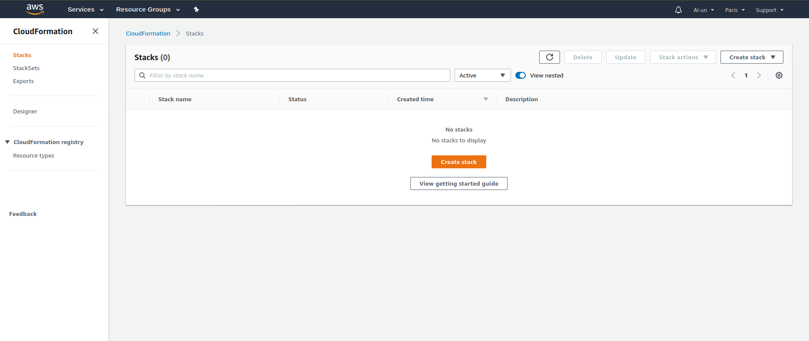
<sub>CloudFormation empty console</sub>

The various examples below help illustrating the purpose of each section. For a more formal approach, some useful links:

**AWS documentation**:

- [AWS CloudFormation API reference](https://docs.aws.amazon.com/AWSCloudFormation/latest/APIReference/Welcome.html)
- [AWS CloudFormation Template Anatomy](https://docs.aws.amazon.com/AWSCloudFormation/latest/UserGuide/template-anatomy.html)
- [`Parameters`](https://docs.aws.amazon.com/AWSCloudFormation/latest/UserGuide/parameters-section-structure.html)
- [`Conditions`](https://docs.aws.amazon.com/AWSCloudFormation/latest/UserGuide/conditions-section-structure.html)
- [`Mappings`](https://docs.aws.amazon.com/AWSCloudFormation/latest/UserGuide/mappings-section-structure.html)
- [`Resources`](https://docs.aws.amazon.com/AWSCloudFormation/latest/UserGuide/resources-section-structure.html)

Other notes:

- [AWS CloudFormation `AWSTemplateFormatVersion` latest version is `2010-09-09`](https://docs.aws.amazon.com/AWSCloudFormation/latest/UserGuide/format-version-structure.html)
- [`DependsOn` attribute of Resources](https://docs.aws.amazon.com/AWSCloudFormation/latest/UserGuide/aws-attribute-dependson.html)

### Functions

Some functions will be used to ease the template definitions. Those functions will be explained when encountered in the templates below.

- [`!FindInMap` / `Fn::FindInMap` to search a value in `Mappings`](https://docs.aws.amazon.com/AWSCloudFormation/latest/UserGuide/intrinsic-function-reference-findinmap.html)
- [`!Join` / `Fn::Join` for concatenating values](https://docs.aws.amazon.com/AWSCloudFormation/latest/UserGuide/intrinsic-function-reference-join.html)
- [`!Ref` / `Fn::Ref` for getting resource value or parameter value](https://docs.aws.amazon.com/AWSCloudFormation/latest/UserGuide/intrinsic-function-reference-ref.html)
- [`!Sub` / `Fn::Sub` for variable substitution](https://docs.aws.amazon.com/AWSCloudFormation/latest/UserGuide/intrinsic-function-reference-sub.html)

### Resources documentation

As I spend quite a lot of times to find back "what are the properties of this resources", here is a list of all resources CloudFormation documentation:

- [`AWS::CertificateManager::Certificate`](https://docs.aws.amazon.com/AWSCloudFormation/latest/UserGuide/aws-resource-certificatemanager-certificate.html)
  - [ACM now automatically DNS-validates certificate with CloudFormation](https://aws.amazon.com/about-aws/whats-new/2020/06/aws-certificate-manager-extends-automation-certificate-issuance-via-cloudformation/)
  - [ACM best practices](https://docs.aws.amazon.com/acm/latest/userguide/acm-bestpractices.html#best-practices-validating)
- [`AWS::CloudFront::CloudFrontOriginAccessIdentity`](https://docs.aws.amazon.com/AWSCloudFormation/latest/UserGuide/aws-resource-cloudfront-cloudfrontoriginaccessidentity.html)
- [`AWS::CloudFront::Distribution`](https://docs.aws.amazon.com/AWSCloudFormation/latest/UserGuide/aws-resource-cloudfront-distribution.html)
  - [AWS Pricing: AWS CloudFront](https://aws.amazon.com/cloudfront/pricing/)
- [`AWS::IAM::Role`](https://docs.aws.amazon.com/AWSCloudFormation/latest/UserGuide/aws-resource-iam-role.html)
- [`AWS::Lambda::Function`](https://docs.aws.amazon.com/AWSCloudFormation/latest/UserGuide/aws-resource-lambda-function.html)
  - https://serverlesscode.com/post/cloudformation-deploy-lambda-resources/
- [`AWS::Lambda::Permission`](https://docs.aws.amazon.com/AWSCloudFormation/latest/UserGuide/aws-resource-lambda-permission.html)
  - [Solve Circular dependency in AWS S3 <> Lambda permission](https://aws.amazon.com/premiumsupport/knowledge-center/unable-validate-circular-dependency-cloudformation/)
  - https://www.lars-berning.de/avoiding-circular-dependency-problems-in-aws-cloudformation/
- [`AWS::Route53::RecordSetGroup`](https://docs.aws.amazon.com/AWSCloudFormation/latest/UserGuide/aws-resource-route53-recordsetgroup.html)
- [`AWS::Route53::RecordSet`](https://docs.aws.amazon.com/AWSCloudFormation/latest/UserGuide/aws-properties-route53-recordset.html)
  - [`AWS::Route53::RecordSet` `AliasTarget`](https://docs.aws.amazon.com/AWSCloudFormation/latest/UserGuide/aws-properties-route53-aliastarget-1.html)
    - `Z2FDTNDATAQYW2` is the _HostedZoneId_ for CloudFront resources ([link](https://docs.aws.amazon.com/Route53/latest/APIReference/API_AliasTarget.html))
- [`AWS::S3::Bucket`](https://docs.aws.amazon.com/AWSCloudFormation/latest/UserGuide/aws-properties-s3-bucket.html)
- [`AWS::S3::BucketPolicy`](https://docs.aws.amazon.com/AWSCloudFormation/latest/UserGuide/aws-properties-s3-policy.html)
  - [Policies and Permissions in Amazon S3](https://docs.aws.amazon.com/AmazonS3/latest/dev/access-policy-language-overview.html)

### CLI

The most useful command is `aws cloudformation deploy --stack-name <stack name>`. Such command is convenient:

- it automatically creates a stack if the provided _stack name_ does not exist
- it automatically updates the stack matching the provided _stack name_.

For a more step-by-step control, stacks can be manually created (`aws cloudformation create-stack`) and deleted (`aws cloudformation delete-stack`). During the creation or updates, AWS generates **change-sets** which sequentially defines the list of actions to meet the template requirements.

Precautious fellows can check the change sets before having them executed:

- `aws cloudformation create-change-set --stack-name <stack name> --change-set-name <change set name> --template-body ...` create a change set in a given stack but does not execute it
- `aws cloudformation describe-change-set --stack-name <stack name> --change-set-name <change set name>` lists all the operations the change set will trigger if executed.
- `aws cloudformation execute-change-set --stack-name <stack name> --change-set-name <change set name>` finally execute the change set and the stack will be updated according to the new template definition

**AWS Documentation**:

- [`aws cloudformation`](https://docs.aws.amazon.com/cli/latest/reference/cloudformation/index.html#cli-aws-cloudformation)

## Basic HTTP hosting

Hosting a static web on AWS starts with a single S3 bucket. Such website is restricted to have a specific URL: _http://{bucket name}.s3-website.{region}.amazonaws.com_ which is more than enough for testing some simple websites.

The simplicity of a basic hosting is a good opportunity to do a soft introduction to CloudFormation template.

### Step by step template definition

All we need is a simple S3 bucket with a website configuration. The bucket content is fully public and such access can be controlled by a bucket policy. The CloudFormation template can be drafted as:

```yaml
AWSTemplateFormatVersion: 2010-09-09

Resources:
  S3Hosting:
    Type: AWS::S3::Bucket
    Properties:
      # TODO

  S3HostingBucketPolicy:
    Type: AWS::S3::BucketPolicy
    Properties:
      # TODO
```

`S3Hosting` and `S3HostingBucketPolicy` are the _logical ID_ of the S3 bucket and the bucket policy resources. Logical ID are arbitrary and let's try to have them as explicit as possible.

Filling the properties boils down to googling the properties list and pick up the relevant ones. The [Resources documentation](#resources-documentation) section is a list of such documentation links.

If we want to name our bucket `bw-hosting-basic`, our template can be defined as

```yaml
AWSTemplateFormatVersion: 2010-09-09

Resources:
  S3Hosting:
    Type: AWS::S3::Bucket
    Properties:
      # That's our bucket name
      BucketName: bw-hosting-basic
      # We declare this bucket a website hosting, similar to the
      # website configuration in the properties tab in the web console
      WebsiteConfiguration:
        ErrorDocument: 404.html
        IndexDocument: index.html

  S3HostingBucketPolicy:
    Type: AWS::S3::BucketPolicy
    Properties:
      # This policy is declared for the bucket above
      Bucket: bw-hosting-basic
      PolicyDocument:
        Id: MyPolicy
        Version: 2012-10-17
        Statement:
          # The Sid is an arbitrary value
          - Sid: PublicReadForGetBucketObjects
            # Public access so fetching an object is allowed for everything
            Effect: Allow
            Principal: "*"
            Action: s3:GetObject
            # This policy is limited to the bucket defined in this stack, hey,
            # it is not open-bar!
            Resource: arn:aws:s3:::bw-hosting-basic/*
```

Nice! But it is not very DRY: `bw-hosting-basic` is written three times. Let's put the bucket name into a `BucketName` parameter with `bw-hosting-basic` as a default value. A parameter value can be overridden during the CloudFormation stack deployment.

```yaml
AWSTemplateFormatVersion: 2010-09-09

Parameters:
  BucketName:
    Type: String
    Default: bw-hosting-basic

Resources:
  # ...
```

The `BucketName` parameter is a variable that we have to interpolate in our template. `!Ref` function enters the scene. To compare with SCSS syntax, writing `!Ref someVarName` is similar to `#{$someVarName}` in SCSS grammar. Our bucket definition becomes:

```yaml
# ...

Resources:
  S3Hosting:
    Type: AWS::S3::Bucket
    Properties:
      BucketName: !Ref BucketName
      WebsiteConfiguration:
        ErrorDocument: 404.html
        IndexDocument: index.html
```

Each AWS resource will return a specific value when called upon a `!Ref` function. For example `!Ref {a bucket logical ID}` returns the bucket name. Other resources may have other values such as the ARN.

`!Ref` ensures that our bucket policy is applied to the correct bucket:

```yaml
# ...
S3HostingBucketPolicy:
  Type: AWS::S3::BucketPolicy
  Properties:
    Bucket: !Ref S3Hosting
    PolicyDocument:
      # How to call !Ref in "arn:aws:s3:::bw-basic-hosting/*"?
```

AWS documentation makes use of the `!Join` function:

```yaml
S3HostingBucketPolicy:
  Properties:
    # ...
    PolicyDocument:
      Id: MyPolicy
      Version: 2012-10-17
      Statement:
        - Sid: PublicReadForGetBucketObjects
          Effect: Allow
          Principal: "*"
          Action: "s3:GetObject"
          Resource: !Join
            - ""
            - - "arn:aws:s3:::"
              - !Ref S3Hosting
              - /*
```

I prefer the `!Sub` syntax: `!Sub arn:aws:s3:::${S3Hosting}/*`.

The end result is the [`template-basic.yaml`](template-basic.yaml).

> Note: although the different tutorials and guides add `AccessControl: PublicRead` in the S3Hosting bucket definition, I did not need it so I removed it.

### Deployment

It is now time to deploy! Deploying is as simple as

```sh
# Feel free to change "bw-hosting-basic" to whatever value
aws cloudformation deploy --stack-name bw-hosting-basic --template-file template-basic.yaml
```

This command will block the terminal until the stack creation is completed:

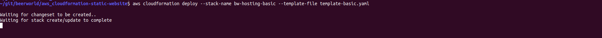

> To deploy the same stack with a different bucket name, the bucket name parameter has to be overridden:
>
> ```sh
> # I changed the stack name. If the stack name was bw-hosting-basic, it would have updated the
> # previous stack
> aws cloudformation deploy --stack-name bw-hosting-basic-custom-name --template-file template-basic.yaml --parameter-overrides BucketName=some-other-name
> ```

Stack creation progress can be checked in the web console:

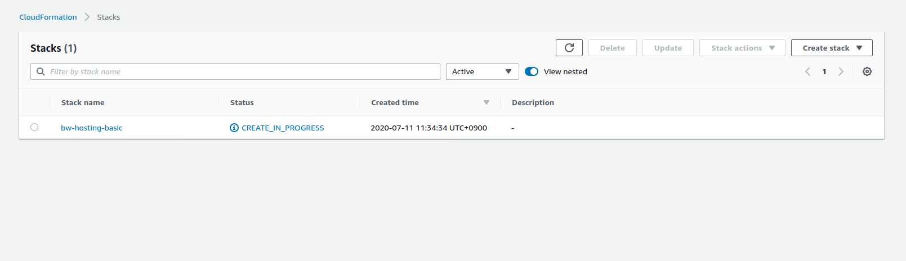

Select the stack and check the _Events_ tab to follow the creation steps:

| Creation in progress                                                                      | Creation completed                                                                        |
| ----------------------------------------------------------------------------------------- | ----------------------------------------------------------------------------------------- |
| 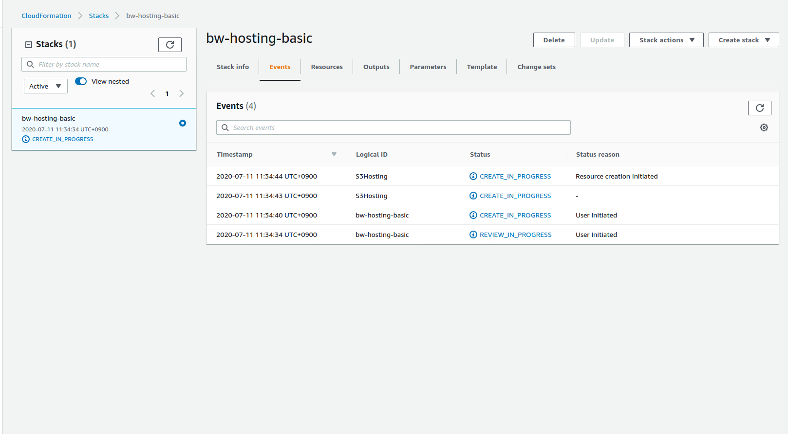 | 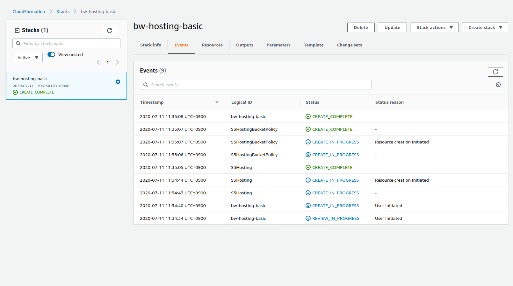 |

When stack deployment is finished, you get back the control of the terminal:

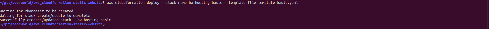

> To check what name the bucket is currently having:
>
> ```sh
> aws cloudformation describe-stack-resource --stack-name bw-hosting-basic --logical-resource-id S3Hosting
> ```

Time to upload some content:

```sh
# Use the CLI to send some content to a S3 bucket
aws s3 sync website s3://bw-basic-hosting --profile alun
```

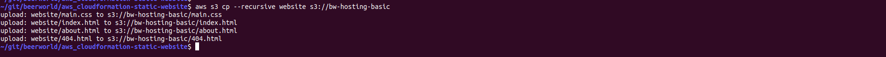

S3 content can be checked in the web console:

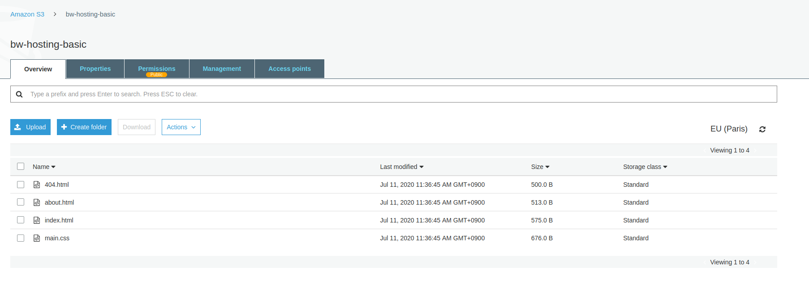

```sh
# Open the URL with firefox
firefox http://bw-basic-hosting.s3-website.eu-west-3.amazonaws.com/
```

The website has two pages: `/index.html` and `/about.html`. The former ensures that `/` properly serves the index page and the latter checks that non-SPA websites are properly served:

| Index page                                                        | About page                                                                |
| ----------------------------------------------------------------- | ------------------------------------------------------------------------- |
| 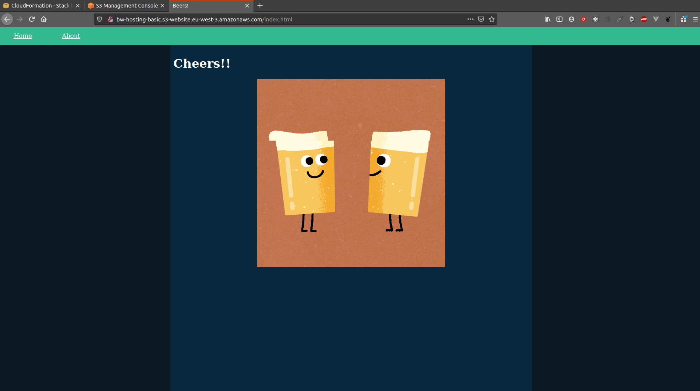 | 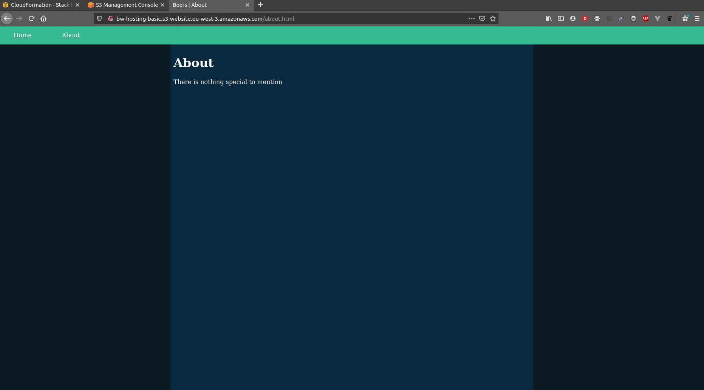 |

### Stack deletion

S3 buckets cannot be deleted if not empty. The stack deletion then requires two actions:

```sh
aws s3 rm --recursive s3://bw-hosting-basic
```

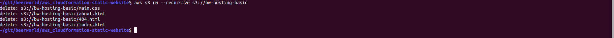

```sh
aws cloudformation delete-stack --stack-name bw-hosting-basic
```

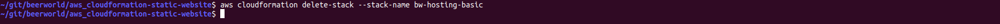

Unlike stack creation, stack deletion is not blocking: the command is fired and the terminal is not blocked. It also means that errors might not shown up so better check in the web console if the deletion went fine:

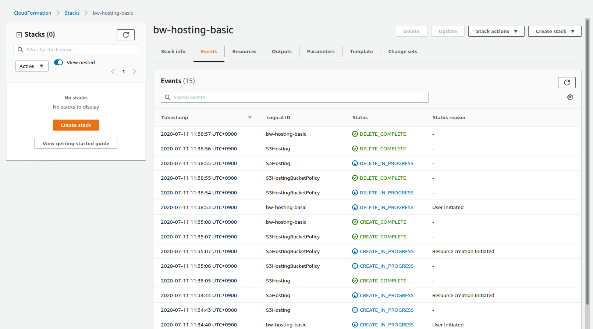

## Custom URL/domain

All systems online! but online behind a not-very-user-friendly-URL.

### With AWS Route53

This section specificity is that the bucket name **must** match the target domain name: `example.com` must be hosted in a bucket with the same name. It also applies to subdomains: `subdomain.example.com` must be hosted in a bucket with exactly the same name.

This template can be built from the previous template:

- `BucketName` parameter is renamed `DomainName` to be more explicit
- Unlike AWS template snippets, I had to keep the S3 bucket policy
- Two more resources are added: the S3 bucket for redirection and Route 53 entries

The S3 redirection bucket, typically redirecting _www.example.com_ to _example.com_, is simply defined as follow:

```yaml
S3Redirection:
  Type: AWS::S3::Bucket
  Properties:
    AccessControl: BucketOwnerFullControl
    BucketName: !Sub www.${DomainName}
    WebsiteConfiguration:
      RedirectAllRequestsTo:
        HostName: !Ref S3Hosting
```

> Note: I am not sure if the `AccessControl` can be dropped or not as I just copied from AWS snippet

The Route 53 DNS entries handles both domain _example.com_ and _www.example.com_ by pointing them to the appropriate resources. The following code is simply copied from AWS snippet.

```yaml
DNSEntries:
  Type: AWS::Route53::RecordSetGroup
  Properties:
    HostedZoneName: !Ref RootDomainName
    RecordSets:
      - AliasTarget:
          HostedZoneId: !FindInMap [S3Regions, !Ref "AWS::Region", ZoneId]
          DNSName: !FindInMap [S3Regions, !Ref "AWS::Region", Endpoint]
        Name: !Ref DomainName
        Type: A
      - Name: !Sub www.${DomainName}
        ResourceRecords:
          - !GetAtt S3Redirection.DomainName
        Type: CNAME
        TTL: 900
```

The final template is [`template-domain-aws.yaml`](template-domain-aws.yaml).

Deployment and stack deletion commands are the same:

```sh
aws cloudformation deploy --stack-name bw-hosting-domain-aws --template-file template-domain-aws.yaml
aws s3 sync website s3://bw-domain-aws.al-un.fr

aws s3 rm --recursive s3://bw-domain-aws.al-un.fr
aws cloudformation delete-stack --stack-name bw-hosting-domain-aws
```

References:

- [Amazon S3 Template Snippets](https://docs.aws.amazon.com/AWSCloudFormation/latest/UserGuide/quickref-s3.html#scenario-s3-bucket-website)
- [S3 website endpoint and hosted zone ID](https://docs.aws.amazon.com/general/latest/gr/s3.html#s3_website_region_endpoints)

### With CloudFlare

Similarly to the previous example, the bucket name **must** match the target domain name. As Route 53 is not used, the `RootDomainName` parameter is now unnecessary.

```yaml
Parameters:
  DomainName:
    Type: String
    Default: bw-hosting-domain-cloudflare.al-un.fr
```

CloudFlare has to do Route 53's job: handle a CNAME entry (such as _example.com_ or _app.example.com_) pointing to the S3 bucket website endpoint (such as _example.com.s3-website.<AWS region>.amazonaws.com_ or _app.example.com.s3-website.<AWS region>.amazonaws.com_).

> When editing DNS entries, don't forget to strip out ending slashes and the protocol (no `http://`).

This can easily be done in the web interface by creating a DNS entry:

- type: _CNAME_
- name: your subdomain name or `@` for the root domain (such as `example.com`)
- target: the S3 bucket website endpoint
- TTL: automatic or any desired value

Such DNS entry creation can also be performed with the Cloudflare API. A token with DNS edition permission on the appropriate domain is required. To create the DNS record ([Cloudflare docs](https://api.cloudflare.com/#dns-records-for-a-zone-create-dns-record))

```sh
curl "https://api.cloudflare.com/client/v4/zones/<zone id>/dns_records" -X POST \
-H "Authorization: Bearer <token>" \
-H "Content-Type: application/json" \
--data @- <<'EOF'
{
  "type": "CNAME",
  "name": "bw-hosting-domain-cloudflare",
  "content": "bw-hosting-domain-cloudflare.al-un.fr.s3-website.eu-west-3.amazonaws.com",
  "ttl": 1
}
EOF
```

**References**:

- https://wsvincent.com/static-site-hosting-with-s3-and-cloudflare/

### Deployment (Cloudflare example)

Stack creation and upload to S3 commands are the same:

```sh
aws cloudformation deploy --stack-name bw-hosting-domain --template-file template-domain-cloudflare.yaml
# Bucket name is copied from the template
aws s3 cp --recursive website s3://bw-hosting-domain-cloudflare.al-un.fr
```

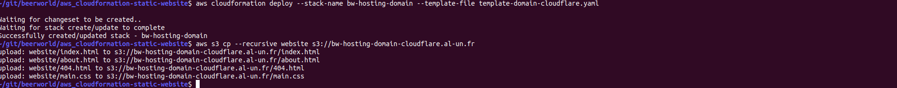

Create the CNAME record either via the CLI or the web console:

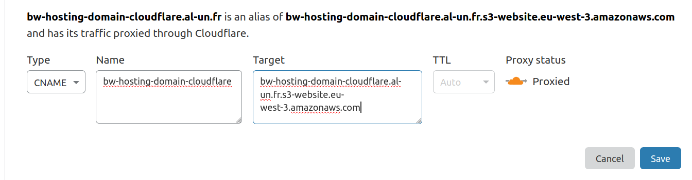

Both page are now served under `bw-hosting-domain-cloudflare.al-un.fr`:

| Index page                                                                            | About page                                                                            |
| ------------------------------------------------------------------------------------- | ------------------------------------------------------------------------------------- |
| 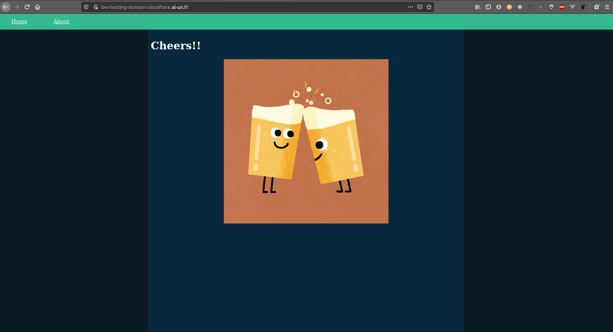 | 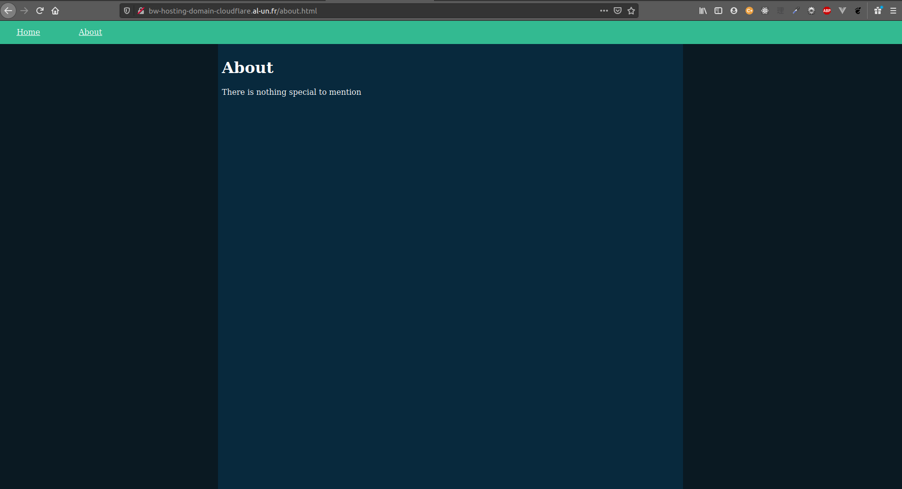 |

Stack deletion steps are identical to the basic HTTP hosting stack deletion steps.

## HTTPS redirection

A custom URL is nicer with HTTPS right? This is where we need CloudFront.

### With AWS Route 53

#### Certificate stack

> From June 2020, CloudFormation can automatically create the DNS entries to validate a certificate request. However, if the stack is deleted, only the certificate is deleted. The DNS entries used to validate the domain remain and must be manually deleted if required.

To be accessible to CloudFront, AWS Certificates **must** be created in North Virginia (_us-east-1_). An option is to create a dedicated stack. As only the certificate is created in _us-east-1_, the stack is light:

```yaml
AWSTemplateFormatVersion: 2010-09-09

Resources:
  Certificate:
    Type: AWS::CertificateManager::Certificate
    Properties:
      DomainName: app.example.com
      DomainValidationOptions:
        - DomainName: app.example.com
          HostedZoneId: <example.com. ZoneID>
      ValidationMethod: DNS
```

The [`template-https-aws-acm.yaml`](template-https-aws-acm.yaml) is an example of a single certificate validating two sub domains of the same root domains.

<sub>This template example can be improved by having some parameters</sub>

```sh
# Create the stack in us-east-1. From now on, it is recommended to pass
# the --region argument to ensure that we are hitting the right spot
aws cloudformation deploy --stack-name bw-https-aws-acm --template-file template-https-acm.yaml --region us-east-1

# Describe the certificate to check the Certificate ARN
aws cloudformation describe-stack-resource --stack-name bw-https-aws-acm --logical-resource-id Certificate --region us-east-1
```

Alternatively, we can use the `Output` section in the template. Although it sounds overkill as the certificate ARN is easy to find, the output would look like:

```yaml
Outputs:
  CertificateArn:
    Value: !Ref Certificate
    Description: "Certificate ARN"
```

#### Main stack

The HTTPS redirection is managed by CloudFront. CloudFront can serve a S3 bucket by identifying itself with a CloudFront origin identity. Some changes are worth to note:

- S3 bucket name is not tied to the domain anymore
- S3 bucket does not need a website configuration anymore

```yaml
Parameters:
  CertificateArn:
    Type: String
    Description: Certificate must be created before CloudFormation stack so the value is fixed
  BucketName:
    Type: String
  DomainName:
    Type: String

Resources:
  S3Hosting:
    Type: AWS::S3::Bucket
    Properties:
      BucketName: !Ref BucketName

  # Declare the identity of our CloudFront distribution
  CDNOriginIdentity:
    Type: AWS::CloudFront::CloudFrontOriginAccessIdentity
    Properties:
      CloudFrontOriginAccessIdentityConfig:
        Comment: !Sub "Cloudfront Origin identity for ${DomainName}"

  CDN:
    Type: "AWS::CloudFront::Distribution"
    Properties:
      DistributionConfig:
        Aliases:
          - !Ref DomainName
        DefaultCacheBehavior:
          # ... some configs are omitted for brievity
          TargetOriginId: !Sub "S3-origin-${S3Hosting}"
          # This is where we define the HTTPS redirection
          ViewerProtocolPolicy: redirect-to-https
        DefaultRootObject: index.html
        Enabled: True
        Origins:
          - DomainName: !GetAtt S3Hosting.RegionalDomainName
            Id: !Sub "S3-origin-${S3Hosting}"
            S3OriginConfig:
              OriginAccessIdentity: !Sub "origin-access-identity/cloudfront/${CDNOriginIdentity}"
        PriceClass: PriceClass_100 # PriceClass_100 / PriceClass_200 / PriceClass_All
        # The SSL certificate used
        ViewerCertificate:
          AcmCertificateArn: !Ref CertificateArn
          MinimumProtocolVersion: TLSv1.2_2018
          SslSupportMethod: sni-only
```

> Note about `DomainName: !GetAtt S3Hosting.RegionalDomainName`: see [this StackOverflow post](https://stackoverflow.com/a/58423033/4906586)

The S3 bucket policy can now restrict access to the CloudFront distribution only:

```yaml
Resources:
  S3HostingBucketPolicy:
    Type: AWS::S3::BucketPolicy
    Properties:
      Bucket: !Ref S3Hosting
      PolicyDocument:
        Statement:
          - Action:
              - "s3:GetObject"
            Effect: Allow
            Principal:
              AWS: !Sub "arn:aws:iam::cloudfront:user/CloudFront Origin Access Identity ${CDNOriginIdentity}"
            Resource: !Sub "arn:aws:s3:::${S3Hosting}/*"
        Version: "2012-10-17"
```

The last step is to create a DNS entry with Route 53 to have a nice URL such `https://app.example.com` rather than some `xxxxxxxxxxxxx.cloudfront.net`:

```yaml
Resources:
  DNS:
    Type: AWS::Route53::RecordSetGroup
    Properties:
      HostedZoneName: !Ref RootDomainName
      RecordSets:
        - AliasTarget:
            DNSName: !GetAtt CDN.DomainName
            HostedZoneId: Z2FDTNDATAQYW2 # CloudFront hosted zone ID is fixed
          Name: !Ref DomainName
          Type: A
```

The deployment process and content upload to S3 is the same as the previous example.

### With Cloudflare

> Note: I am using CloudFlare SSL certificate so the actual certificate is not delivered by Amazon but CloudFlare but this example should work with any DNS manager.

#### Certificate stack

The certificate is still managed by AWS but the DNS validation has to be done in Cloudflare. The certificate stack is lighter than the AWS counterpart:

```yaml
AWSTemplateFormatVersion: 2010-09-09

Resources:
  Certificate:
    Type: AWS::CertificateManager::Certificate
    Properties:
      DomainName: bw-https.al-un.fr
      ValidationMethod: DNS
```

> If multiple domains must be covered by this certificate, the `SubjectAlternativeNames` also works here.

Deployment has also to be done in North Virginia:

```sh
aws cloudformation deploy --stack-name bw-hosting-https-acm --region us-east-1 --template-file template-https-cloudflare-acm.yaml
```

Don't forget this command is blocking until the stack creation is completed:
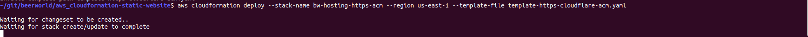

To find the ACM stack, make sure that region is switched to _North Virginia / us-east-1_

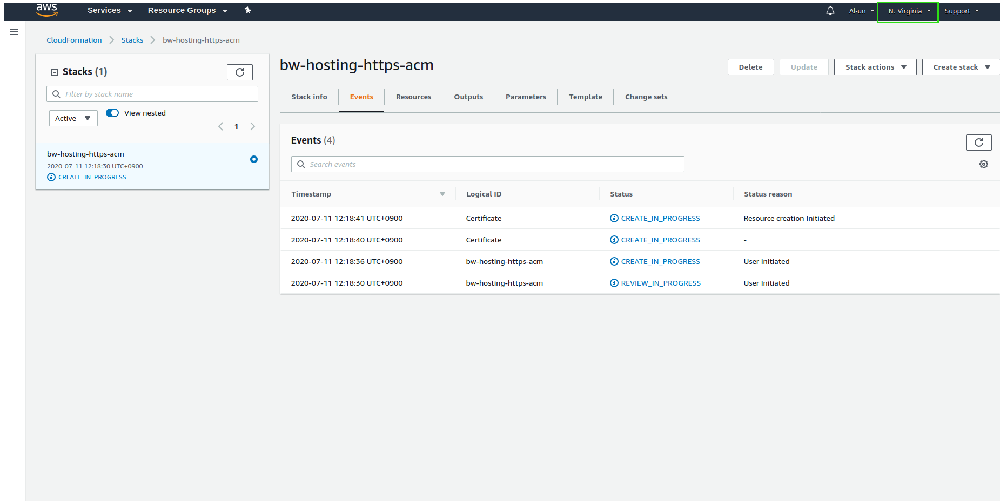

Open the certificate manager to check that a certificate request is created. Make sure you are still in _us-east-1_:

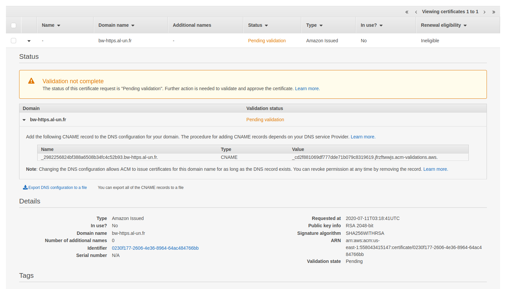

To validate the certificate, you must create the CNAME records in Cloudflare as defined in AWS Certificate manager:

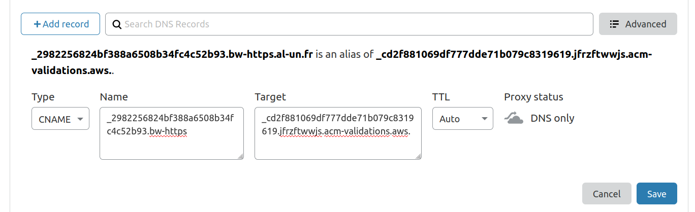

Get yourself a coffee and let AWS works on its own. After a while, the certificate will be issued:

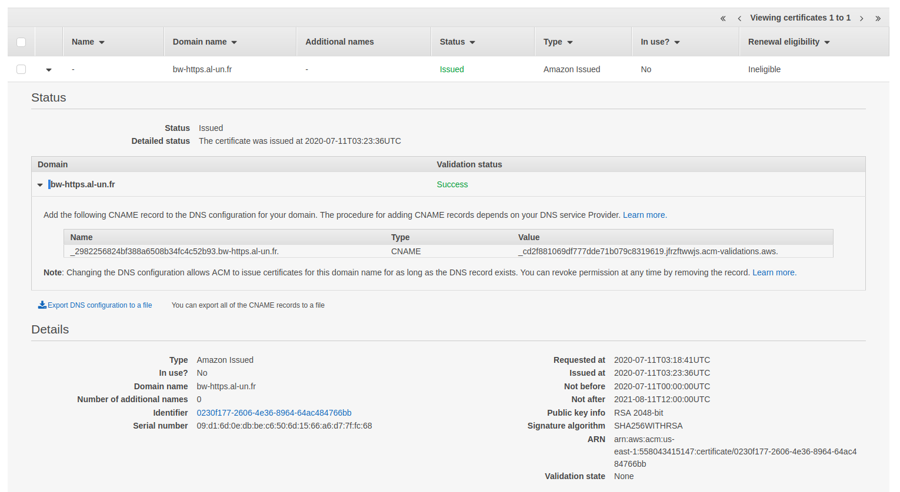

The ACM stack creation is then completed:

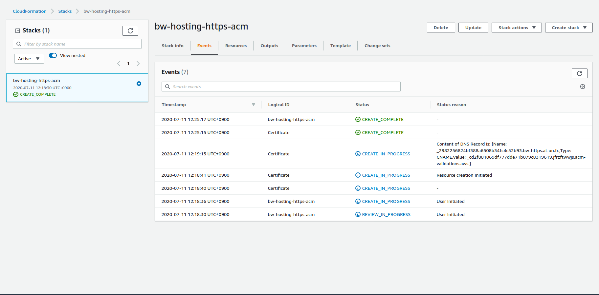

#### Main stack

The Cloudflare HTTPS main stack is very similar to the AWS version. There are two differences:

- There is no Route 53 resources as DNS entries are handled by Cloudflare
- An output property display the CDN domain name that will be used in the CNAME record in Cloudflare

```sh
# Obviously, you have to adjust the CertificateArn parameter value
aws cloudformation deploy --stack bw-hosting-https --region eu-west-3 --template-file template-https-cloudflare.yaml --parameter-override CertificateArn="arn:aws:acm:us-east-1:558043415147:certificate/0230f177-2606-4e36-8964-64ac484766bb"

aws s3 cp --recursive website s3://bw-hosting-https-cloudflare
```

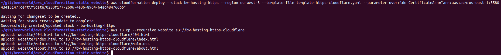

The CloudFront distribution usually takes a while (few minutes) to be created:

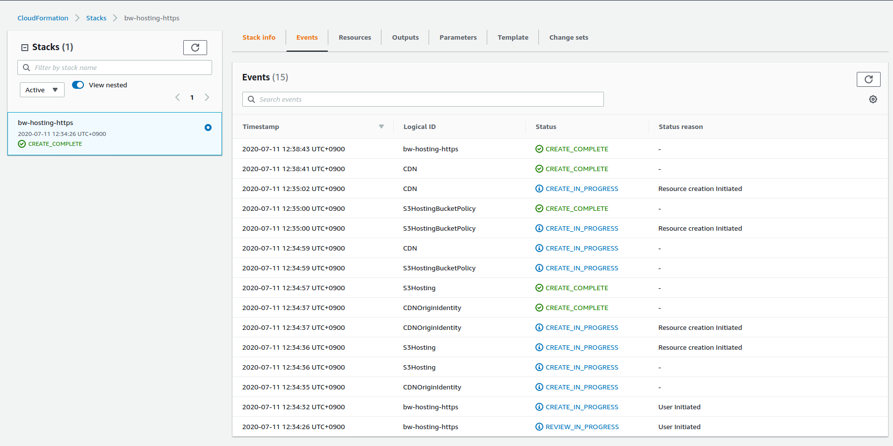

When the stack is up, the last step is to create the CNAME record in Cloudflare matching the domain name and pointing to the CloudFront (CDN) domain name. As there is an `Outputs` property in the template, there is no need to browser CloudFront distributions:

| CloudFront domain name                                                                      | DNS record creation                                                                    |
| ------------------------------------------------------------------------------------------- | -------------------------------------------------------------------------------------- |
| 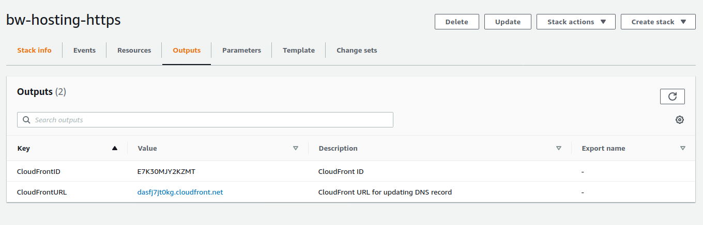 | 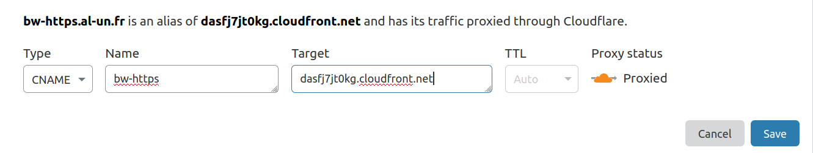 |

Inputting the `http://` URL now automatically redirects to the `https://` URL:

| Index page                                                                             | About page                                                                             |
| -------------------------------------------------------------------------------------- | -------------------------------------------------------------------------------------- |
| 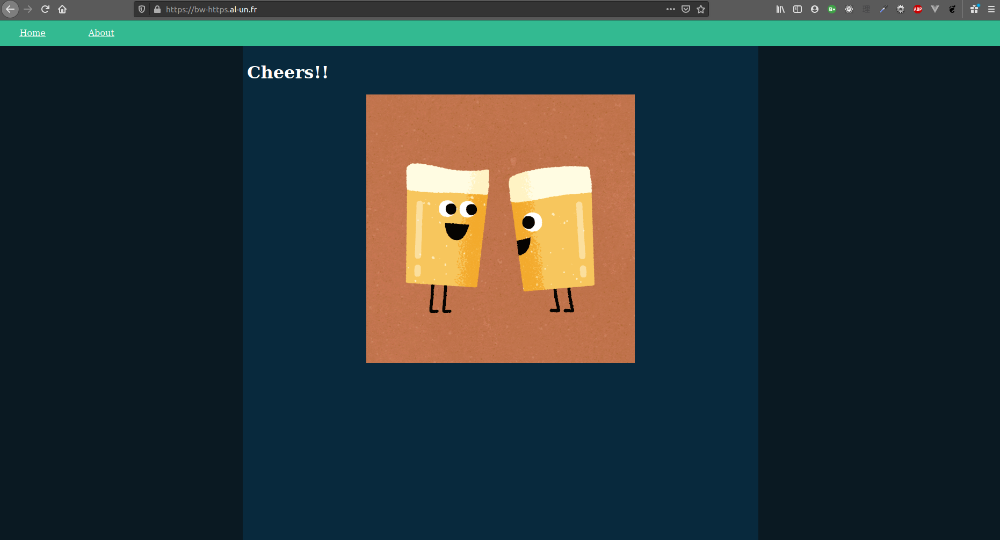 | 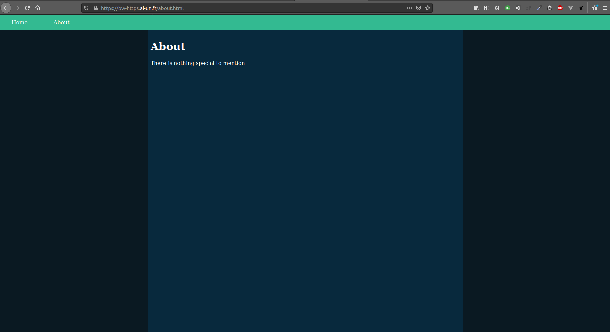 |

Delete this stack before the ACM stack. Also, don't forget to remove the DNS entries in Cloudflare (DNS validation CNAME entry and CDN CNAME entry).

## CloudFront cache invalidation

This section has not much difference between Route 53 and Cloudflare so my example will rely on the Cloudflare option only. For the Route 53 option, please refer to the HTTPS example.

> This section does not deal with service workers! If you use service workers, make sure that cache is properly managed.

### Certificate

The AWS Certificate is the same as before and has to be deployed first to get the ARN.

- Deploy the ACM stack in _us-east-1_
  ```sh
  aws cloudformation deploy --stack-name bw-hosting-invalidate-cache-acm --template-file template-invalidate-cache-acm.yaml --region us-east-1
  ```
- Create the CNAME entries in Cloudflare to validate the certificate

### Main stack

Our previous configuration (CDN, S3 bucket) mainly remains the same. The core idea is to invalidate Cloudfront cache whenever the hosting bucket is updated:

- To avoid spamming notifications, only updates on `index.html` trigger a notification
- A lambda function processes the notification by creating an invalidation in the appropriate Cloudfront distribution

> Note, the order of resources declaration in the template file does not matter but I try to be as closed as possible to the actual order of resources creation

<sub>IAM fun starts here</sub>

#### S3 event notification

Adding the notification to the S3 bucket will change the resource definition into:

```yaml
S3Hosting:
  Type: AWS::S3::Bucket
  Properties:
    BucketName: !Ref BucketName
    NotificationConfiguration:
      LambdaConfigurations:
        - Event: s3:ObjectCreated:*
          Filter:
            S3Key:
              Rules:
                - Name: suffix
                  Value: index.html
          Function: <some lambda ARN>
```

However, this sole declaration lacks permission: the S3 bucket is now allowed to invoke the lambda provided by its ARN:

```yaml
S3PermissionToCacheInvalidationLambda:
  Type: AWS::Lambda::Permission
  Properties:
    FunctionName: !GetAtt CacheInvalidationLambda.Arn
    Action: lambda:InvokeFunction
    Principal: s3.amazonaws.com
    SourceAccount: !Ref AWS::AccountId
    SourceArn: !Sub "arn:aws:s3:::${BucketName}"
```

> Note that for `SourceArn: !Sub "arn:aws:s3:::${BucketName}"`, I am not referring with `!Ref S3Hosting`. Doing so would end up with a circular reference:
>
> 1. Build the S3 bucket will require the permission
> 2. Building the permission will require the S3 bucket
>
> Fatal error!

The resource "chain" is then _Lambda > S3PermissionToCacheInvalidationLambda > S3Hosting_.

#### Cache invalidation lambda

A lambda function must be declared with an IAM role to define its access scope. To avoid cyclical reference (same as previous permission declaration), the lambda IAM role cannot target a specific Cloudfront distribution and must have access to all Cloudfront distributions.

The lambda has to be authorised to:

- List all Cloudfront distribution without any restriction
- Create Cloudfront cache invalidation
- Create log group (Required only if the `LogGroup` is not created by CloudFormation)
- Logs

```yaml
Parameters:
  # ...
  CacheInvalidationLambdaName:
    Type: String
    Default: <some lambda function name>

Resources:
  CacheInvalidationLambdaIamRole:
    Type: AWS::IAM::Role
    Properties:
      AssumeRolePolicyDocument:
        Version: 2012-10-17
        Statement:
          - Action:
              - sts:AssumeRole
            Effect: Allow
            Principal:
              Service:
                - lambda.amazonaws.com
      Description: IAM role for the Lambda to invalidate CloudFront cache
      Policies:
        - PolicyName: CloudFrontCacheInvalidationPolicy
          PolicyDocument:
            Version: 2012-10-17
            Statement:
              - Action:
                  - cloudfront:ListDistributions
                Effect: Allow
                Resource: "*"
              - Action:
                  - cloudfront:CreateInvalidation
                Effect: Allow
                Resource: !Sub "arn:aws:cloudfront::${AWS::AccountId}:distribution/*"
        - PolicyName: CloudWatchPolicy
          PolicyDocument:
            Version: 2012-10-17
            Statement:
              - Action:
                  - "logs:CreateLogStream"
                  - "logs:PutLogEvents"
                Effect: Allow
                Resource: !Sub "arn:aws:logs:${AWS::Region}:${AWS::AccountId}:log-group:/aws/lambda/${CacheInvalidationLambdaName}/*"
              # Required only if LogGroup is not created by the stack
              - Action:
                  - "logs:CreateLogGroup"
                Effect: Allow
                Resource: !Sub "arn:aws:logs:${AWS::Region}:${AWS::AccountId}:*"
      RoleName: !Sub "${CacheInvalidationLambdaName}-role"
```

Once the IAM role is ready, declaring the lambda function is a straight:

```yaml
CacheInvalidationLambda:
  Type: AWS::Lambda::Function
  Properties:
    Code:
      ZipFile: |
        ...Enter the lambda code here...
    FunctionName: <lambda function name>
    Handler: index.handler
    Role: !GetAtt CacheInvalidationLambdaIamRole.Arn
    Runtime: nodejs12.x
    Timeout: 30
```

Lambda code is skipped for clarity. The real code can be found in

- [`template-invalidate-cache.yaml`](template-invalidate-cache.yaml)
- [`lambda-invalidate-cache.js`](lambda-invalidate-cache.js) for syntax highlighting and some comments

Optionally, the log group can be declared as a resource of the stack:

```yaml
CacheInvalidationLambdaLogGroup:
  Type: AWS::Logs::LogGroup
  Properties:
    LogGroupName: !Sub "/aws/lambda/${CacheInvalidationLambda}"
    RetentionInDays: 30
```

If you don't declare the log group as a resource, you have to add the permission to create a log group to IAM role:

```yaml
CacheInvalidationLambdaIamRole:
  Type: AWS::IAM::Role
  Properties:
    # ...
    Policies:
      # ....
      - PolicyName: CloudWatchPolicy
        PolicyDocument:
          Version: 2012-10-17
          Statement:
            # ...
            # This part:
            - Action:
                - "logs:CreateLogGroup"
              Effect: Allow
              Resource: !Sub "arn:aws:logs:${AWS::Region}:${AWS::AccountId}:*"
```

Having the log group in the stack ensures that the log group is also deleted when the stack is deleted. If the log group is created automatically by the lambda, it is not deleted when the stack is deleted.

#### Deployment

This stack requires IAM capabilities provided by the `--capabilities CAPABILITY_NAMED_IAM` argument

```sh
aws cloudformation deploy --stack-name bw-hosting-invalidate-cache --template-file template-invalidate-cache.yaml --capabilities CAPABILITY_NAMED_IAM --region eu-west-3
aws s3 cp --recursive website s3://bw-hosting-invalidate-cache
```

> Don't forget to create the CNAME entry in your DNS entries pointing to the Cloudfront distribution domain name

Upon any upload of any `index.html`, the cache is invalidated for all files:

| Check in CloudFront distribution                                                                   | Check in CloudWatch log group                                                   |
| -------------------------------------------------------------------------------------------------- | ------------------------------------------------------------------------------- |
| 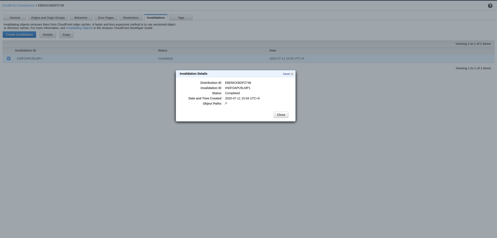 | 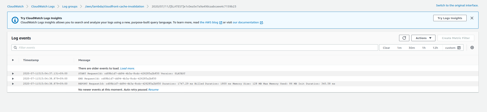 |

## Extra miles

CloudFormation offers capabilities than are not covered (yet?) by the guide / repo:

- [Deletion policy](https://docs.aws.amazon.com/AWSCloudFormation/latest/UserGuide/aws-attribute-deletionpolicy.html): when a CloudFormation stack is deleted, some resources might be needed to be kept.
- CloudFront origin path: all the examples use the whole bucket to host a website but multiple websites, if served by a CloudFront distribution, can be hosted on the same bucket. An use case example is to have a folder per environment: `development/`, `staging/` and `production/`
- CloudFormation nested stack: A stack (child stack) can be defined as a resource of another stack (parent stack). This is useful when multiple stacks share common resources: the common resources are defined in the root stack and the various stacks are configured as children stacks, getting the common resources value (ARN, name, ID...) through parameters
- `Mappings` property allows template re-usability. A good use case is to re-use a CloudFormation template for multiple environment and the Mappings would list all values such as:

  ```yaml
  Mappings:
    EnvMaps:
      develop:
        Domain: dev.example.com
      staging:
        Domain: stg.example.com
      production:
        Domain: example.com
  ```
