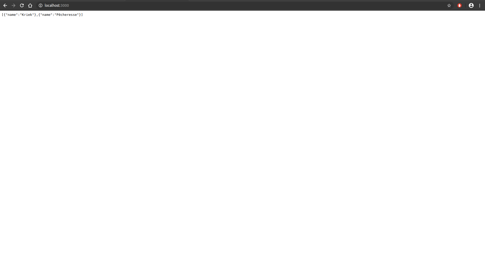

**Table of content**

- [Run the examples](#run-the-examples)
- [Setup](#setup)
  - [Installation](#installation)
    - [Installing on Ubuntu](#installing-on-ubuntu)
    - [Docker hello-world example](#docker-hello-world-example)
    - [sudo or not sudo](#sudo-or-not-sudo)
  - [Docker Hub](#docker-hub)
- [Docker basic concepts](#docker-basic-concepts)
  - [Containerization vs virtualization](#containerization-vs-virtualization)
  - [Images and containers](#images-and-containers)
- [Dockerfile](#dockerfile)
  - [Dockerfile minimal content](#dockerfile-minimal-content)
  - [`ADD` vs `COPY`](#add-vs-copy)
  - [`ARG` vs `ENV`](#arg-vs-env)
- [Build the image](#build-the-image)
  - [Build contexts](#build-contexts)
- [Run the container](#run-the-container)
  - [Stop, (re)start and delete containers](#stop-restart-and-delete-containers)
  - [Execute a specific command on a running container](#execute-a-specific-command-on-a-running-container)
  - [Pruning](#pruning)
- [Building efficient Docker images](#building-efficient-docker-images)
  - [Build cache](#build-cache)
  - [Multi-stage builds](#multi-stage-builds)
  - [Entrypoints and initial command](#entrypoints-and-initial-command)
- [Next steps](#next-steps)
- [Various references](#various-references)

# Docker: getting started <!-- omit in toc -->

Let's take our first step in the world of containerization with Docker!

## Run the examples

If Docker is already installed, both server and client containers can be started as follow:

```sh
# Run server instance, check http://localhost:8000
sudo docker run -d -p 8000:3000 alunsng/beerworld:docker-getting-started_server
# Run client instance, check http://localhost:8080
sudo docker run -dt -p 8080:80 alunsng/beerworld:docker-getting-started_client
```

> Note: the server **must** run with port 8000 as the client image was built that way. The client port, however, can have a value different from 8080.

<details>
  <summary>Output examples</summary>

**Spawning server container**:

```
Unable to find image 'alunsng/beerworld:docker-getting-started_server' locally
docker-getting-started_server: Pulling from alunsng/beerworld
c9b1b535fdd9: Already exists
2c4c61e0a2e7: Already exists
b246603cbb51: Already exists
b160c036a6aa: Already exists
69fea0355218: Pull complete
8271a9903db5: Pull complete
26eb0e2b599c: Pull complete
1cd7db4e1df6: Pull complete
dd1fd0173d22: Pull complete
Digest: sha256:bd514e97ecc88848a4635f8b4ece54df9a8e60d840616e325866db26ee342028
Status: Downloaded newer image for alunsng/beerworld:docker-getting-started_server
19aa72995aac8bf31cb8a15cc30e5f6c9745ddeed5d8197426519cee39a41f87
```

**Spawning client container**

```
Unable to find image 'alunsng/beerworld:docker-getting-started_client' locally
docker-getting-started_client: Pulling from alunsng/beerworld
4167d3e14976: Already exists
d9176111d0ef: Already exists
cff212942e9d: Pull complete
Digest: sha256:907ed39eb2e281632ee756a61f162293e33134aeba6eaa73e7ff63f5ab14f55b
Status: Downloaded newer image for alunsng/beerworld:docker-getting-started_client
fbf31233346b4ac462b89509c34b0d9a2d74a87e35377a9c4f98e78c7f71b011
```

</details>

You can check that both containers are running with

```sh
sudo docker ps
```

Both projects have multiple Dockerfile for learning purpose only. Only the final version is uploaded to Docker hub.

## Setup

### Installation

From the [Docker installation page](https://docs.docker.com/install/), please install the version suited for your OS. If you are running on Windows 10 or macOS, you may enjoy Docker Desktop. On Linux, the Docker Engine must be used. There are two versions: the community edition and the enterprise edition. Let's go with the community edition.

#### Installing on Ubuntu

The [Docker engine installation guide](https://docs.docker.com/install/linux/docker-ce/ubuntu/) is pretty straightforward.

<details>

  <summary>For lazy persons such as myself, here the commands from the guide:</summary>

```sh
# Uninstall old version if applicable
sudo apt-get remove docker docker-engine docker.io containerd runc

# Update the apt package index
sudo apt-get update

# Install packages to allow `apt` to use a repository over HTTP
sudo apt-get install \
    apt-transport-https \
    ca-certificates \
    curl \
    gnupg-agent \
    software-properties-common

# Add Docker's official GPG key
curl -fsSL https://download.docker.com/linux/ubuntu/gpg | sudo apt-key add -

# Add the latest stable repository (x64_64 architecture)
sudo add-apt-repository \
   "deb [arch=amd64] https://download.docker.com/linux/ubuntu \
   $(lsb_release -cs) \
   stable"

# Update the apt package index
sudo apt-get update

# Install the latest version of Docker Engine
sudo apt-get install docker-ce docker-ce-cli containerd.io

# Verify that Docker engine is properly installed
sudo docker --version
# Or by running the hello-world
sudo docker run hello-world
```

</details>

#### Docker hello-world example

Running the `hello-world` should output something like

```
Unable to find image 'hello-world:latest' locally
latest: Pulling from library/hello-world
1b930d010525: Pull complete
Digest: sha256:9572f7cdcee8591948c2963463447a53466950b3fc15a247fcad1917ca215a2f
Status: Downloaded newer image for hello-world:latest

Hello from Docker!
This message shows that your installation appears to be working correctly.

To generate this message, Docker took the following steps:
 1. The Docker client contacted the Docker daemon.
 2. The Docker daemon pulled the "hello-world" image from the Docker Hub.
    (amd64)
 3. The Docker daemon created a new container from that image which runs the
    executable that produces the output you are currently reading.
 4. The Docker daemon streamed that output to the Docker client, which sent it
    to your terminal.

To try something more ambitious, you can run an Ubuntu container with:
 $ docker run -it ubuntu bash

Share images, automate workflows, and more with a free Docker ID:
 https://hub.docker.com/

For more examples and ideas, visit:
 https://docs.docker.com/get-started/
```

The following command display the list of containers:

```sh
sudo docker ps -a
```

And the output should look like

```
CONTAINER ID    IMAGE         COMMAND       CREATED           STATUS                      PORTS       NAMES
7dcfe8097cd7    hello-world   "/hello"      54 seconds ago    Exited (0) 52 seconds ago               optimistic_kepler
```

I prefer to clean up my containers list so let's

```sh
sudo docker rm optimistic_kepler
```

<sub>Replace `optimistic_kepler` by the correct container name</sub>

#### sudo or not sudo

By default, Docker commands require root privileges hence the `sudo` in my examples above. In [Post-installation steps for Linux](https://docs.docker.com/install/linux/linux-postinstall/), there is a way to use `docker` command as a non-root user. As a Docker newbie, I just have the default configuration and `sudo` all the time.

### Docker Hub

Optionally, you can create a Docker Hub account at [https://hub.docker.com/](https://hub.docker.com/). Docker Hub is an image repository and the free account allows a private repository. It will allow to share your images but also pull your own images for some other cool stuff such as Kubernetes or Docker Swarm.

---

## Docker basic concepts

Let's close our terminal and IDE to get back to our favourite browser. Now that everything is installed, it's time to grab some concepts before writing anything.

As for this experiment, I obviously started with some tutorials. I remember spending quite a lot of time on [the Docker for beginner tutorial by Prakhar Srivastav](https://docker-curriculum.com/). For the applications development, I moved back to my current comfort zone for the server and client applications: JavaScript. Both [Node.js official Dockerization guide](https://nodejs.org/en/docs/guides/nodejs-docker-webapp/) and [Vue.js official Dockerization guide](https://vuejs.org/v2/cookbook/dockerize-vuejs-app.html) are quite light and straightforward. I will rely on both guides for this little experiment of mine.

Of course, I could not escape from [Docker overview](https://docs.docker.com/engine/docker-overview/). Across my various readings, many technical terms popped up but two of them seemed to take a leading role: _images_ and _containers_. So let's focus on them for now.

### Containerization vs virtualization

Containerization is _not_ virtualization. For those versed in virtualization topics, or simply if you are curious, understanding the differences between containerization and virtualization is an interesting digression.

> <<TODO>>: list up sources

### Images and containers

At first, it was not very clear to me what the differences between _images_ and _containers_ are. I guess my mistake was rushing into knowing _"Which one will provide me my `http://localhost:3000`?"_. To cut to the chase: it is a container. How?

What I needed to know, at this stage, was:

A **container**:

- is a runnable "instance"
- can be started, stopped and started again. Persistance details (data and database) to be checked later
- can have its ports mapped to the host machine ports

An **image**:

- is the template from which a container is created from.
- is static, meaning it cannot be changed once created. Any modification always implies recreating an image
- can have multiple variations thanks to tags. Tags can be used for versioning but not only.

So if I want something in my `http://localhost:xxxx`, I need a container which requires an image. And here comes the _Dockerfile_: the recipe of Docker images.

> Further reading:
>
> - [_Docker Image vs Container: Everything you need to know_ on Stackify](https://stackify.com/docker-image-vs-container-everything-you-need-to-know/)

## Dockerfile

A Dockerfile is a simple text file listing a series of instructions. When starting an empty virtual machine, scripting comes to be useful to avoid repeating tasks such as installing a specific runtime version, installing some third-party tools, and so on. A Dockerfile has a similar role: starting from a base image, a series of commands which modify our base image until reaching the desired state.

The previous definition shows that any built image can be a base image to any Dockerfile. However, it is preferred to have a base image as small as possible to reduce the size footprint.

> Some readings:
>
> - [Docker quickstart](https://docs.docker.com/get-started/part2/)
> - [Docker documentation: Dockerfile reference](https://docs.docker.com/engine/reference/builder/)

### Dockerfile minimal content

Using the `server/` application, the most basic Dockerfile, `server/server-v1.Dockerfile`, is the following one which does the bare minimum:

- Based on a NodeJS ready linux distribution, copy our code
- Install the dependencies, in this JavaScript example with NPM
- Define the starting command as `node index.js`

```dockerfile
# server/server-v1.Dockerfile

# I developed under node-13.7.0 at the time I wrote this experiment
FROM node:13.7.0-alpine

# Define target folder in the container instance
WORKDIR /usr/src/app

# Copy our source code
COPY . .

# Install dependencies
RUN npm install

# CMD is the defaut command which can be overriden on container startup
CMD [ "node", "index.js" ]
```

> Notes: The `CMD` instruction will be detailed in the [Entrypoint and initial command](#entrypoints-and-initial-command) section

### `ADD` vs `COPY`

**TODO**

### `ARG` vs `ENV`

**TODO**

## Build the image

The Dockerfile is now ready for an image build:

```sh
cd docker-getting-started
sudo docker build -f ./server/server-v1.Dockerfile -t alunsng/beerworld:docker-getting-started_server-v1 ./server
```

- `-f` specificies the Dockerfile location
- `-t` specificies the tag of the image. The argument is optional and is only used to convenience of the document.
- `./server` specifies the context of the build

> If you want to push the images in your own Docker Hub, please consider using appropriate tags.

<details>
   <summary>Expand to see the whole output</summary>

```
Sending build context to Docker daemon  21.98MB
Step 1/5 : FROM node:13.7.0-alpine
13.7.0-alpine: Pulling from library/node
c9b1b535fdd9: Already exists
07b35de5c8a5: Pull complete
a0b0418c013a: Pull complete
f4ac4306c751: Pull complete
Digest: sha256:b82067eea7667f53747a282f0c1aa66037570bceea4a9c03b4ef963c11d59aea
Status: Downloaded newer image for node:13.7.0-alpine
---> b809734bb743
Step 2/5 : WORKDIR /usr/src/app
---> Running in 06c54f50fd6e
Removing intermediate container 06c54f50fd6e
---> 244699193d72
Step 3/5 : COPY . .
---> 850b8633848f
Step 4/5 : RUN npm install
---> Running in 4ec6697bf924
audited 398 packages in 1.594s

3 packages are looking for funding
run `npm fund` for details

found 1 low severity vulnerability
run `npm audit fix` to fix them, or `npm audit` for details
Removing intermediate container 4ec6697bf924
---> 570fa2d71224
Step 5/5 : CMD [ "node", "index.js" ]
---> Running in 8cff6a2bca07
Removing intermediate container 8cff6a2bca07
---> c3571c08219f
Successfully built c3571c08219f
Successfully tagged alunsng/beerworld:docker-getting-started_server-v1
```

</details>

List all Docker images to ensure that our image is properly created:

```sh
sudo docker images
```

which outputs:

```
REPOSITORY            TAG                                IMAGE ID       CREATED         SIZE
alunsng/beerworld     docker-getting-started_server-v1   c3571c08219f   8 seconds ago   129MB
```

> [`docker build` reference](https://docs.docker.com/engine/reference/commandline/build/)

### Build contexts

When building an image, Docker switches between two contexts:

- _Builder context_: the context on the machine which executes the docker command
- _Built context_: the context in the Docker images.

> _Builder context_ and _Builded context_ are not an official wording and is only used for distinguish both contexts.

The _context_ question is the same as asking _What `pwd` will return on the builder and built contexts?_. First of all, how are those contexts defined?

- _Builder context_: the last argument of the `sudo docker build` command is the path of the _builder context_. In the previous example, assuming the shell context is `${beerproject repository path}/docker-getting-started`, the _builder context_ is `./server`.
- _Built context_: the `WORKDIR` instruction in the Dockerfile defines the _built context_. In the previous example, the `WORKDIR` is `/usr/src/app`.

The build contexts main purpose is clarity by avoiding `../../.. ...` paths. `COPY . .` means \_copy from "builder context" to "built context" which is lighter than `COPY ./docker-getting-started/server /usr/src/app`

**Notes**:

- The Dockerfile can be located _out of_ the builder context. The `sudo docker build` command can indeed load a specific Dockerfile with the `-f` argument
- When building an image, only resources within the _builder context_ are accessible. If a file in another folder is requested, an error will be thrown.
- The _builder context_ can also be a git repository!

> Additional reading:
>
> [`docker build` reference](https://docs.docker.com/engine/reference/commandline/build/)

---

## Run the container

A container can now be started

```sh
# Start container
sudo docker run -d -p 3000:3000 alunsng/beerworld:docker-getting-started_server-v1
# The output is something like
db7a9c755369d4d51dcb0f103c761b67d9a94bd63e00e662d0be970b07979eba
```

Notes:

- If you used a custom tag or no tag during the build, make sure the container starts the proper image
- `-d` argument starts the container in _detached_ mode which frees the terminal
- `-p` argument maps the container `3000` port to the host `3000` port

Check the running containers:

```sh
sudo docker ps -a
```

which outputs:

```
CONTAINER ID  IMAGE                                                COMMAND                  CREATED           STATUS          PORTS                    NAMES
db7a9c755369  alunsng/beerworld:docker-getting-started_server-v1   "docker-entrypoint.s…"   11 seconds ago    Up 10 seconds   0.0.0.0:3000->3000/tcp   vibrant_mestorf
```

Your `http://localhost:3000` should now display a dull:



> Docker documentation reference
>
> - [Docker documentation: `run` reference](https://docs.docker.com/engine/reference/run/)
> - [`docker run`](https://docs.docker.com/engine/reference/commandline/run/)

### Stop, (re)start and delete containers

To stop the container:

```sh
# Stop with container ID. I copied the visible ID but three characters are enough as long as it is not ambiguous
sudo docker stop db7a9c755369
# Stop with container name. Name can be specified when spawning the container
sudo docker stop vibrant_mestorf
```

Similarly, a stopped container can be started with the `start` command instead of the `stop command:

```sh
sudo docker start db7a9c755369
# Or
sudo docker start vibrant_mestorf
```

If a container is not required, it can be deleted. It is recommended to stop the container before deleting it. This warning is addressed to those who uses the `--force` argument too quickly

```sh
sudo docker rm db7a9c755369
# Or
sudo docker starmrt vibrant_mestorf
```

> Docker documentation reference
>
> - [`docker stop`](https://docs.docker.com/engine/reference/commandline/stop/)
> - [`docker start`](https://docs.docker.com/engine/reference/commandline/start/)
> - [`docker rm`](https://docs.docker.com/engine/reference/commandline/rm/)

### Execute a specific command on a running container

While a container is up, it is not deaf and still listen to you :) If a specific command has to be executed in a running container, the `exec` command is here for you:

```sh
sudo docker exec {container ID} {command}
```

It is specifically useful for opening a shell session to have a look:

```sh
sudo docker exec -it db7a9c755369 sh
```

### Pruning

Try-fail-and-try-again method is a good way to learn. My docker images and containers lists being quickly messy, I really wanted a quick way to clear things:

```sh
sudo docker system prune
```

> [Docker `system prune` documentation](https://docs.docker.com/engine/reference/commandline/system_prune/)

## Building efficient Docker images

Beyond building a simple image, Docker has many awesomeness yet to be explored. Here are some of them:

### Build cache

What happens when Docker builds an image? It takes a base image and "transforms" this base image into another image by adding a layer. The result can be seen as an image composed of the base image and this simple layer. This process is recursive and can obviously be indefinively repeated.

Let's create the `server/server-v2.Dockerfile` by splitting the `COPY` command in two parts: let's first copy the `package.json` and `package-lock.json` and everything else _after_ installing the dependencies:

```diff
+ COPY package*.json ./
- COPY . .

RUN npm install

+ # Copy our API source code AFTER installing dependencies
+ COPY . .
```

Let's build a first time:

```sh
sudo docker build -f ./server/server-v2.Dockerfile -t alunsng/beerworld:docker-getting-started_server-v2 ./server
```

<details>
   <summary>Assuming this is the first build, the output is similar as before, except that the node:13.7.0-alpine image is already downloaded</summary>

```
Sending build context to Docker daemon  21.98MB
Step 1/6 : FROM node:13.7.0-alpine
 ---> b809734bb743
Step 2/6 : WORKDIR /usr/src/app
 ---> Running in a409fcd5e2eb
Removing intermediate container a409fcd5e2eb
 ---> 06892d5a4ea6
Step 3/6 : COPY package*.json ./
 ---> 4f23390ac7c0
Step 4/6 : RUN npm install
 ---> Running in f2d3d3f02fe0

> core-js@2.6.11 postinstall /usr/src/app/node_modules/core-js
> node -e "try{require('./postinstall')}catch(e){}"

Thank you for using core-js ( https://github.com/zloirock/core-js ) for polyfilling JavaScript standard library!

The project needs your help! Please consider supporting of core-js on Open Collective or Patreon:
> https://opencollective.com/core-js
> https://www.patreon.com/zloirock

Also, the author of core-js ( https://github.com/zloirock ) is looking for a good job -)

added 164 packages from 158 contributors and audited 398 packages in 4.534s

3 packages are looking for funding
  run `npm fund` for details

found 1 low severity vulnerability
  run `npm audit fix` to fix them, or `npm audit` for details
Removing intermediate container f2d3d3f02fe0
 ---> 4928450df7c7
Step 5/6 : COPY . .
 ---> 8eb03f09c308
Step 6/6 : CMD [ "node", "index.js" ]
 ---> Running in 5c8f6375f80b
Removing intermediate container 5c8f6375f80b
 ---> fd6b1a26145a
Successfully built fd6b1a26145a
Successfully tagged alunsng/beerworld:docker-getting-started_server-v2
```

</details>

Now, modify a tiny bit of code. I modify a `console.log`:

```diff
# server/index.js

- console.log(`Listen to port http://${HOST}:${PORT}...`);
+ console.log(`Hey! Listen to port http://${HOST}:${PORT}...`);
```

And re-build both images:

```sh
sudo docker build -f ./server/server-v1.Dockerfile -t alunsng/beerworld:docker-getting-started_server-v1 ./server
sudo docker build -f ./server/server-v2.Dockerfile -t alunsng/beerworld:docker-getting-started_server-v2 ./server
```

<details>
  <summary>The v1 version output shows that dependencies were re-installed...</summary>

```
Sending build context to Docker daemon  21.98MB
Step 1/5 : FROM node:13.7.0-alpine
 ---> b809734bb743
Step 2/5 : WORKDIR /usr/src/app
 ---> Using cache
 ---> 06892d5a4ea6
Step 3/5 : COPY . .
 ---> a5609c7cf9f3
Step 4/5 : RUN npm install
 ---> Running in c800ac7d29da
audited 398 packages in 1.747s

3 packages are looking for funding
  run `npm fund` for details

found 1 low severity vulnerability
  run `npm audit fix` to fix them, or `npm audit` for details
Removing intermediate container c800ac7d29da
 ---> ea960b63b574
Step 5/5 : CMD [ "node", "index.js" ]
 ---> Running in 89cfa1a393ec
Removing intermediate container 89cfa1a393ec
 ---> 3dfa3800c742
Successfully built 3dfa3800c742
Successfully tagged alunsng/beerworld:docker-getting-started_server-v1

```

</details>

<details>
  <summary>...while the v2 versions output shows "using cache"</summary>

```
Sending build context to Docker daemon  21.98MB
Step 1/6 : FROM node:13.7.0-alpine
 ---> b809734bb743
Step 2/6 : WORKDIR /usr/src/app
 ---> Using cache
 ---> 06892d5a4ea6
Step 3/6 : COPY package*.json ./
 ---> Using cache
 ---> 4f23390ac7c0
Step 4/6 : RUN npm install
 ---> Using cache
 ---> 4928450df7c7
Step 5/6 : COPY . .
 ---> 89544b579bf7
Step 6/6 : CMD [ "node", "index.js" ]
 ---> Running in c8f672afb658
Removing intermediate container c8f672afb658
 ---> 72bbadad8ba9
Successfully built 72bbadad8ba9
Successfully tagged alunsng/beerworld:docker-getting-started_server-v2

```

</details>
 
> Behold the power of onions:
>
> It took me more time than it should to grasp this concept. The image of an "onion" (thank you Tor) greatly improved my vision of this concept. A starting image is the core of the onion. Each command generates a layer of the onion which wraps the previous result, either the core of the onion or the onion so-far.
>
> To understand which layer will be rebuilt, I decomposed my final onion in each layer and check how the layer is generated. If the layer composition does not change, it will be cached and then not re-built.

That's some cool optimisation already. When checking the generated images, images size can be checked as well:

```
REPOSITORY          TAG                                IMAGE ID       CREATED         SIZE
alunsng/beerworld   docker-getting-started_server-v2   72bbadad8ba9   2 minutes ago   150MB
alunsng/beerworld   docker-getting-started_server-v1   3dfa3800c742   2 minutes ago   129MB
```

Are Docker images allowed to do some diet? Docker has a good prescription for them: _Multi-stage builds_!

### Multi-stage builds

Time for the `client/` application to shine here. _Multi-stage_ optimization is striking for front-end as, in the end, the application ends up being an innocent static website.

Following the [Vue.js cookbook](https://vuejs.org/v2/cookbook/dockerize-vuejs-app.html), let's start with the naive Dockerfile:

```dockerfile
FROM node:13.7.0-alpine AS build-stage

# install simple http server for serving static content
RUN npm install -g http-server

WORKDIR /app

# Install dependencies
COPY package*.json ./
RUN npm install

# copy project files and folders to the current working directory (i.e. 'app' folder)
COPY . .

# build app for production with minification
RUN npm run build

EXPOSE 8080
CMD [ "http-server", "dist" ]
```

with the corresponding image build:

```sh
sudo docker build -f ./client/client-v1.Dockerfile  -t alunsng/beerworld:docker-getting-started_client-v1 ./client/
```

<details>
   <summary>Build output:</summary>

```
Sending build context to Docker daemon  97.03MB
Step 1/9 : FROM node:13.7.0-alpine AS build-stage
 ---> 532fd65ecacd
Step 2/9 : RUN npm install -g http-server
 ---> Running in 053ceb4a2184
npm WARN deprecated mkdirp@0.5.4: Legacy versions of mkdirp are no longer supported. Please update to mkdirp 1.x. (Note that the API surface has changed to use Promises in 1.x.)
/usr/local/bin/http-server -> /usr/local/lib/node_modules/http-server/bin/http-server
/usr/local/bin/hs -> /usr/local/lib/node_modules/http-server/bin/http-server
+ http-server@0.12.1
added 26 packages from 35 contributors in 9.077s
Removing intermediate container 053ceb4a2184
 ---> 9e390673bffb
Step 3/9 : WORKDIR /app
 ---> Running in a6c7225f3908
Removing intermediate container a6c7225f3908
 ---> 9344d9c809c4
Step 4/9 : COPY package*.json ./
 ---> 2a48db0e631a
Step 5/9 : RUN npm install
 ---> Running in fc118b5c4575

> core-js@3.6.4 postinstall /app/node_modules/core-js
> node -e "try{require('./postinstall')}catch(e){}"

Thank you for using core-js ( https://github.com/zloirock/core-js ) for polyfilling JavaScript standard library!

The project needs your help! Please consider supporting of core-js on Open Collective or Patreon:
> https://opencollective.com/core-js
> https://www.patreon.com/zloirock

Also, the author of core-js ( https://github.com/zloirock ) is looking for a good job -)


> ejs@2.7.4 postinstall /app/node_modules/ejs
> node ./postinstall.js

Thank you for installing EJS: built with the Jake JavaScript build tool (https://jakejs.com/)

npm WARN optional SKIPPING OPTIONAL DEPENDENCY: fsevents@1.2.11 (node_modules/fsevents):
npm WARN notsup SKIPPING OPTIONAL DEPENDENCY: Unsupported platform for fsevents@1.2.11: wanted {"os":"darwin","arch":"any"} (current: {"os":"linux","arch":"x64"})

added 1121 packages from 823 contributors and audited 18955 packages in 18.337s

35 packages are looking for funding
  run `npm fund` for details

found 56 vulnerabilities (52 low, 4 moderate)
  run `npm audit fix` to fix them, or `npm audit` for details
Removing intermediate container fc118b5c4575
 ---> 70168bcd2ff2
Step 6/9 : COPY . .
 ---> 0fa90927e29a
Step 7/9 : RUN npm run build
 ---> Running in 2e7060296ba4

> client@0.1.0 build /app
> vue-cli-service build


-  Building for production...
 DONE  Compiled successfully in 5526ms2:58:49 PM

  File                                 Size               Gzipped

  dist/js/chunk-vendors.3a8b5dd6.js    95.89 KiB          34.10 KiB
  dist/js/app.1640cf14.js              3.18 KiB           1.44 KiB
  dist/css/app.76e3e90d.css            0.83 KiB           0.34 KiB

  Images and other types of assets omitted.

 DONE  Build complete. The dist directory is ready to be deployed.
 INFO  Check out deployment instructions at https://cli.vuejs.org/guide/deployment.html

Removing intermediate container 2e7060296ba4
 ---> 324e71fbfc0a
Step 8/9 : EXPOSE 8080
 ---> Running in c6e3a19e2351
Removing intermediate container c6e3a19e2351
 ---> 347113b2156d
Step 9/9 : CMD [ "http-server", "dist" ]
 ---> Running in 92ecc6adf000
Removing intermediate container 92ecc6adf000
 ---> 8ca7933829bd
Successfully built 8ca7933829bd
Successfully tagged alunsng/beerworld:docker-getting-started_client-v1
```

</details>

And without transition, let's create the _Multi-stage_ version:

```dockerfile
# ---------- Building stage
FROM node:13.7.0-alpine AS build-stage

WORKDIR /usr/src/app

COPY package*.json ./
RUN npm install

COPY . .
RUN npm run build

# ---------- Production stage
FROM nginx:stable-alpine as production-stage
EXPOSE 80

# the "build-stage" value of the "--from" argument must match the image
# alias defined in the previous stage
COPY --from=build-stage /usr/src/app/dist /usr/share/nginx/html
CMD ["nginx", "-g", "daemon off;"]
```

I cleared some comments to leave the most important ones only. The section commented as _Building stage_ strongly looks like the previous version: dependencies are installed, source code is copied and application is built. _The difference is that all this image is discarded at the end!_. So what's left? In reality, we went through all the steps for only one folder content: `app/dist/` which can be served statically. That's the multi-stage point: we only keep the part we need in the final result and discard all the intermediate data.

> To stick with the onion image, I imagined the _building stage_ as the first onion. When building the _building stage_, the _production stage_ onion is waiting. Once the _building stage_ onion is completed, then the _production stage_ onion can start growing.
>
> In this Vue.js example, the _production stage_ onion only picks a part of the outer layer (result of the `npm run build` onion layer).

```sh
sudo docker build -f ./client/Dockerfile  -t alunsng/beerworld:docker-getting-started_client ./client/
```

<details>
   <summary>Image build output</summary>

```sh
ending build context to Docker daemon  97.03MB
Step 1/10 : FROM node:13.7.0-alpine AS build-stage
 ---> 532fd65ecacd
Step 2/10 : WORKDIR /usr/src/app
 ---> Running in e94809f2ef72
Removing intermediate container e94809f2ef72
 ---> 1d9a538be423
Step 3/10 : COPY package*.json ./
 ---> 7ca3df2fedf3
Step 4/10 : RUN npm install
 ---> Running in 508e843a3d3f

> core-js@3.6.4 postinstall /usr/src/app/node_modules/core-js
> node -e "try{require('./postinstall')}catch(e){}"

Thank you for using core-js ( https://github.com/zloirock/core-js ) for polyfilling JavaScript standard library!

The project needs your help! Please consider supporting of core-js on Open Collective or Patreon:
> https://opencollective.com/core-js
> https://www.patreon.com/zloirock

Also, the author of core-js ( https://github.com/zloirock ) is looking for a good job -)


> ejs@2.7.4 postinstall /usr/src/app/node_modules/ejs
> node ./postinstall.js

Thank you for installing EJS: built with the Jake JavaScript build tool (https://jakejs.com/)

npm WARN optional SKIPPING OPTIONAL DEPENDENCY: fsevents@1.2.11 (node_modules/fsevents):
npm WARN notsup SKIPPING OPTIONAL DEPENDENCY: Unsupported platform for fsevents@1.2.11: wanted {"os":"darwin","arch":"any"} (current: {"os":"linux","arch":"x64"})

added 1121 packages from 823 contributors and audited 18955 packages in 29.36s

35 packages are looking for funding
  run `npm fund` for details

found 56 vulnerabilities (52 low, 4 moderate)
  run `npm audit fix` to fix them, or `npm audit` for details
Removing intermediate container 508e843a3d3f
 ---> c6f7c7b0ad80
Step 5/10 : COPY . .
 ---> 2e14c09a5217
Step 6/10 : RUN npm run build
 ---> Running in 7cbebcf70cfd

> client@0.1.0 build /usr/src/app
> vue-cli-service build


-  Building for production...
 DONE  Compiled successfully in 5314ms2:47:27 PM

  File                                 Size               Gzipped

  dist/js/chunk-vendors.3a8b5dd6.js    95.89 KiB          34.10 KiB
  dist/js/app.533983de.js              3.18 KiB           1.44 KiB
  dist/css/app.76e3e90d.css            0.83 KiB           0.34 KiB

  Images and other types of assets omitted.

 DONE  Build complete. The dist directory is ready to be deployed.
 INFO  Check out deployment instructions at https://cli.vuejs.org/guide/deployment.html

Removing intermediate container 7cbebcf70cfd
 ---> 6542a4d90ac5
Step 7/10 : FROM nginx:stable-alpine as production-stage
 ---> 5fad07aba15a
Step 8/10 : EXPOSE 80
 ---> Running in d6f16f741ab8
Removing intermediate container d6f16f741ab8
 ---> 003c470806ae
Step 9/10 : COPY --from=build-stage /usr/src/app/dist /usr/share/nginx/html
 ---> 55c64e2a8489
Step 10/10 : CMD ["nginx", "-g", "daemon off;"]
 ---> Running in 96da7a43fafc
Removing intermediate container 96da7a43fafc
 ---> 1bf5a52a1400
Successfully built 1bf5a52a1400
Successfully tagged alunsng/beerworld:docker-getting-started_client
```

</details>

A quick `sudo docker images` shows a 92% gain in image size with multi-stage Dockerfile:

```
REPOSITORY          TAG                                IMAGE ID       CREATED           SIZE
alunsng/beerworld   docker-getting-started_client-v1   8ca7933829bd   2 minutes ago     303MB
alunsng/beerworld   docker-getting-started_client      1bf5a52a1400   13 minutes ago    22.4MB
```

When combining build cache and multi-stage builds, I start to have an idea of how efficient Docker images can be. But that's just the beginning.

### Entrypoints and initial command

**TODO**

## Next steps

- [Docker network](../docker-network/README.md): connect containers together
- [Docker compose](../docker-compose/README.md): for the lazy fellows

## Various references

- https://adilsoncarvalho.com/use-labels-on-your-docker-images-3abe4477e9f5
- https://vsupalov.com/docker-build-pass-environment-variables/
- https://vsupalov.com/docker-arg-env-variable-guide/
- https://medium.com/create-code/docker-environment-variables-and-nginx-93d7173f19ec
- https://goinbigdata.com/docker-run-vs-cmd-vs-entrypoint/
