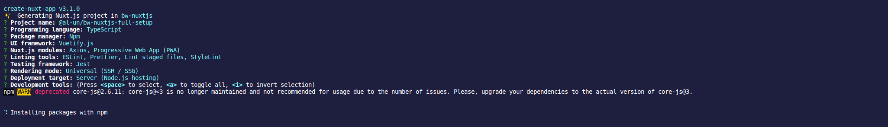

# Nuxtjs full setup <!-- omit in toc -->

Mainly self notes for setting up a Nuxtjs application with:

- Vuetify
- vue-i18n
- Storybook

- [Nuxtjs setup](#nuxtjs-setup)
  - [Nuxtjs](#nuxtjs)
  - [Plugins](#plugins)
- [Storybook setup](#storybook-setup)

## Nuxtjs setup

### Nuxtjs

Start with the magic setup command (see [Nuxtjs docs: installation](https://nuxtjs.org/guide/installation)):

```sh
npx create-nuxt-app
```

[]

> Note: at the time of running `create-nuxt-app` v3.1.0, TypeScript is already configured so there is no need to proceed to any TypeScript setup ([Nuxt TypeScript doc link](https://typescript.nuxtjs.org/guide/setup.html)). [`create-nuxt-app` releases list](https://github.com/nuxt/create-nuxt-app/releases/tag/v2.15.0) mentions the TypeScript support from v2.15.0

> Note 2: starting from `create-nuxt-app` v3.0.0, minimum Node.js version is 10.20.0 (see [v3.0.0. release notes](https://github.com/nuxt/create-nuxt-app/releases/tag/v3.0.0))

### Plugins

## Storybook setup
