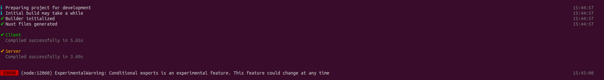
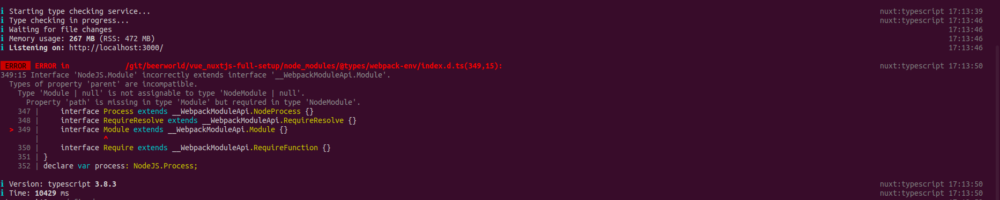
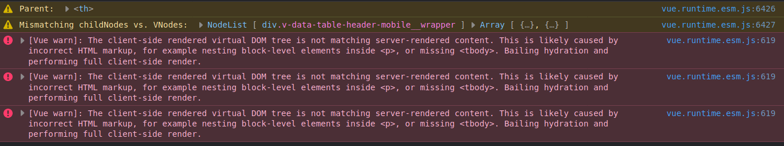

# Nuxtjs full setup <!-- omit in toc -->

Mainly self notes for setting up a Nuxtjs application with Vuetify, vue-i18n and Storybook.

- [Notes](#notes)
  - [09-Jul-2020](#09-jul-2020)
- [Nuxtjs setup](#nuxtjs-setup)
  - [Nuxtjs](#nuxtjs)
  - [Nuxt-vuetify](#nuxt-vuetify)
  - [Nuxt-i18n](#nuxt-i18n)
    - [Setup](#setup)
    - [Create and configure i18n entries](#create-and-configure-i18n-entries)
  - [Conjugate Vuetify with Vue-i18n](#conjugate-vuetify-with-vue-i18n)
- [Storybook setup](#storybook-setup)
  - [Storybook core and addons](#storybook-core-and-addons)
  - [Vue-i18n](#vue-i18n)
  - [Vuetify](#vuetify)
    - [Configuration](#configuration)
  - [vue-i18n integration](#vue-i18n-integration)
  - [Material design icons](#material-design-icons)

> Note: In VS Code, Vetur does not like "monorepo-like" folder structure and will flag TypeScript as `xxx is not a module`. I fixed the issue by opening the folder in a new VS Code window

## Notes

### 09-Jul-2020

- Guide initialisation
- Storybook:
  - no more _addons.js_ nor _config.js_. It is about _main.js_ and _preview.js_ since [Storybook 5.3](https://github.com/storybookjs/storybook/blob/next/MIGRATION.md#to-mainjs-configuration)
  - [`babel-preset-vue` will be removed in Storybook 6.x](https://github.com/storybookjs/storybook/blob/next/MIGRATION.md#removed-babel-preset-vue-from-vue-preset)
  - [No more `|` nor `.` storybook name separator, only `/`](https://github.com/storybookjs/storybook/blob/next/MIGRATION.md#simplified-hierarchy-separators)

## Nuxtjs setup

### Nuxtjs

#### Magic setup <!-- omit in toc -->

Start with the magic setup command (see [Nuxtjs docs: installation](https://nuxtjs.org/guide/installation)):

```sh
npx create-nuxt-app
```

> Starting from `create-nuxt-app` v3.0.0, minimum Node.js version is 10.20.0 (see [v3.0.0. release notes](https://github.com/nuxt/create-nuxt-app/releases/tag/v3.0.0))


#### Post installation actions <!-- omit in toc -->

At the time of running `create-nuxt-app` v3.1.0, TypeScript configuration replacing the NuxtTypeScript setup ([Nuxt TypeScript doc link](https://typescript.nuxtjs.org/guide/setup.html)). [`create-nuxt-app` releases list](https://github.com/nuxt/create-nuxt-app/releases/tag/v2.15.0) mentions the TypeScript support is from v2.15.0.

> The following statements are true as-of July 2020 (`create-nuxt-app` v3.1.0) and future releases might make it irrelevant.

Running `npm run dev` triggers the following error:

```
(node:12060) ExperimentalWarning: Conditional exports is an experimental feature. This feature could change at any time
```



To leverage [TypeScript at runtime](https://typescript.nuxtjs.org/guide/runtime.html), I had to use `nuxt-ts` in my `dev` script. This will be necessary when Vuetify configuration will be customized.

```diff
{
  "scripts": {
-    "dev": "nuxt",
+    "dev": "nuxt-ts",
  },
}
```

When renaming _nuxt.config.js_ into _nuxt.config.ts_, the following error appears:

```
 ERROR  ERROR in /xxxxxx/xxxxxx/git/beerworld/vue_nuxtjs-full-setup/node_modules/@types/webpack-env/index.d.ts(349,15):                       nuxt:typescript 17:13:50
349:15 Interface 'NodeJS.Module' incorrectly extends interface '__WebpackModuleApi.Module'.
  Types of property 'parent' are incompatible.
    Type 'Module | null' is not assignable to type 'NodeModule | null'.
      Property 'path' is missing in type 'Module' but required in type 'NodeModule'.
    347 |     interface Process extends __WebpackModuleApi.NodeProcess {}
    348 |     interface RequireResolve extends __WebpackModuleApi.RequireResolve {}
  > 349 |     interface Module extends __WebpackModuleApi.Module {}
        |               ^
    350 |     interface Require extends __WebpackModuleApi.RequireFunction {}
    351 | }
    352 | declare var process: NodeJS.Process;
```



If _nuxt.config.js_ is not renamed into the TypeScript version but another TypeScript file is involved (e.g. the Vuetify configuration defined later), the error will be raised again.

### Nuxt-vuetify

References:

- [Nuxtjs Vuetify module repo](https://github.com/nuxt-community/vuetify-module)

#### TypeScript setup <!-- omit in toc -->

[_tsconfig.json_ needs to have Vuetify typing](https://github.com/nuxt-community/vuetify-module#typescript):

```json
{
  "compilerOptions": {
    "types": ["@types/node", "@nuxt/types", "@nuxtjs/vuetify"]
  }
}
```

#### Post installation actions <!-- omit in toc -->

`create-nuxt-app` v3.1.0 installed `@nuxtjs/vuetify v1.11.2`. `<v-layout>` being deprecated in favour of `<v-main>`, _layouts/default.vue_ needs a small update:

```diff
<template>
  <v-app dark>
    ...
-    <v-layout>
+    <v-main>
      <v-container>
        <nuxt />
      </v-container>
-    </v-layout>
+    </v-main>
    ...
  </v-app>
</template>
```

#### Playzone <!-- omit in toc -->

I created a [_components/BeerTable.vue_](./components/BeerTable.vue) component to test:

- Icons set
- Handling vuetify translation with vue-i18n

I then added the `BeerTable` component in the [_pages/index.vue_](./pages/index.vue) home page.

Using the `<v-data-table>` caused one issue: the page is generated with a mobile viewport and is then adjusted to desktop viewport during the hydration. This creates a mismatch between the virtual DOM generated by the server (mobile viewport) and the one rendered on the client side (desktop viewport):



### Nuxt-i18n

**References**:

- [`vue-i18n` repo](https://github.com/kazupon/vue-i18n)
- [`vue-i18n` docs](https://kazupon.github.io/vue-i18n/)
- [`nuxt-i18n` repo](https://github.com/nuxt-community/nuxt-i18n)
- [`nuxt-i18n` docs](https://nuxt-community.github.io/nuxt-i18n/)

#### Setup

Following [Nuxt-i18n setup guide](https://nuxt-community.github.io/nuxt-i18n/setup.html):

- Install `nuxt-i18n`:
  ```sh
  npm install nuxt-i18n
  ```
- Add `nuxt-i18n` type in _tsconfig.json_:

  ```json
  {
    "compilerOptions": {
      "types": ["@types/node", "@nuxt/types", "@nuxtjs/vuetify", "nuxt-i18n"]
    }
  }
  ```

#### Create and configure i18n entries

- Create I18n entries in the [_i18n/_](i18n/) folder:

  ```
  {nuxt project}
  i18n/
    en/index.ts
    fr/index.ts
    index.ts <-- for re-export only
  ```

  - Re-exported object keys, in _i18n/index.ts_ are recommended te be the language ISO code: `en`, `fr` ...
  - Depending on your requirements, having the _en/_ and _fr/_ subfolders might be an overkill. I prefer this structure for scalability.

- Add `nuxt-i18n` plugin in _nuxt.config.ts_ and configure `i18n` global variable

  ```js
  export default {
    modules: [
      // ...
      'nuxt-i18n',
    ],
    // ...
    i18n: {
      // configuration here (see below)
    },
  }
  ```

- Update _pages/index.vue_ to use the newly created I18n entries:

  ```html
  <template>
    <div>{{ $t('hello') }}</div>
  </template>
  ```

Regarding the `i18n` configuration, the basic configuration is simply the standard `vue-i18n` configuration:

```js
import messages from './i18n/'

export default {
  // ...
  i18n: {
    defaultLocale: 'fr',
    locales: ['en', 'fr'],
    vueI18n: {
      fallbackLocale: 'en',
      messages,
      // if the keys do not match the locale code:
      // messages: {
      //   en: messages.en,
      //   fr: messages.fr,
      // }
    },
  },
}
```

However, some features are specific to the nuxt plugin, such as lazy loading. The configuration must be declared differently:

```js
export default {
  // ...
  i18n: {
    defaultLocale: 'fr',
    langDir: 'i18n/',
    locales: [
      { code: 'en', iso: 'en-GB', file: 'en/index.ts' },
      { code: 'fr', iso: 'fr-FR', file: 'fr/index.ts' },
    ],
    lazy: true,
  },
}
```

> Note: if `lazy: true`, then `langDir` must be defined and `locales` has to be an array. However, it also works the other way around: if `langDir` is defined and `locales` is an array then `lazy` must be true.

### Conjugate Vuetify with Vue-i18n

[The Vuetify configuration has to be externalized](https://github.com/nuxt-community/vuetify-module#optionspath) to access the Nuxt context. This also allows leveraging TypeScript typing in _vuetify.options.ts_:

```ts
import { Context } from '@nuxt/types'
import { Options } from '@nuxtjs/vuetify'
import VueI18n from 'vue-i18n'
import colors from 'vuetify/es5/util/colors'
import { VuetifyPreset } from 'vuetify/types/services/presets'

/**
 * @see https://github.com/nuxt-community/vuetify-module/pull/99
 * @param ctx Nuxt context
 */
const vuetifyOptions = (ctx: Context): Options => {
  return {
    customVariables: ['~/assets/variables.scss'],
    theme: {
      dark: true,
      disable: false,
      default: false,
      options: {},
      themes: {
        light: {
          primary: colors.teal.lighten2,
          accent: colors.blueGrey.darken3,
          secondary: colors.pink.darken1,
          info: colors.blue.lighten2,
          warning: colors.amber.base,
          error: colors.red.accent4,
          success: colors.green.accent3,
        },
        dark: {
          primary: colors.teal.darken1,
          accent: colors.blueGrey.darken3,
          secondary: colors.pink.darken1,
          info: colors.blue.lighten1,
          warning: colors.amber.base,
          error: colors.red.accent4,
          success: colors.green.accent3,
        },
      },
    },
    lang: {
      // The messages are now handled by vue-i18n so `locales` becomes unnecessary
      locales: {},
      // this value is not relevant anymore but required for TypeScript
      current: 'en',
      t: (key, ...params) => ctx.app.i18n.t(key, params) as string,
    },
  }
}

export default vuetifyOptions
```

As [specified in Vuetify documentation](https://vuetifyjs.com/en/customization/internationalization/#vue-i-18-n), Vuetify specific messages must be declared under the `$vuetify` key:

```ts
// Example of en/index.ts:
import { LocaleMessageObject } from 'vue-i18n/types'

import vuetifyMsgs from './vuetify'

const msgs: LocaleMessageObject = {
  hello: 'Hello!',
  nested: {
    value: 'This is a nested value',
  },
  beer: {
    id: 'ID',
    name: 'Name',
    country: 'Country',
    type: 'Type',
  },
  $vuetify: vuetifyMsgs,
}

export default msgs
```

Vuetify messages must covers all messages, not a partial set of keys:

```ts
// Example of en/vuetify.ts
import { LocaleMessageObject } from 'vue-i18n/types'

// import defaultVuetify from 'vuetify/src/locale/en'
// the `vuetify_default` is a copy of 'vuetify/src/locale/en' content
import defaultVuetify from './vuetify_default'

const msgs: LocaleMessageObject = {
  ...defaultVuetify,
  dataTable: {
    ...defaultVuetify.dataTable,
    itemsPerPageText: 'Beers per page',
  },
  dataFooter: {
    ...defaultVuetify.dataFooter,
    pageText: '{0}>{1} / {2}',
  },
}

export default msgs
```

> Note: I copied the default Vuetify messages instead of importing from `vuetify/src/locale/{locale name}` as I encountered the error:
>
> ```
> Cannot find module 'vuetify/src/locale/en' from 'xxxxxxxx/git/beerworld/vue_nuxtjs-full-setup'
> ```

Our `<v-data-table>` can now have custom translations :tada:!

## Storybook setup

### Storybook core and addons

- Install Storybook
  ```sh
  # Install Storybook
  npm install @storybook/vue --save-dev
  # Only this dependency should be missing
  npm install babel-preset-vue --save-dev
  # Install Storybook addons
  npm install @storybook/addon-knobs @storybook/addon-viewport @storybook/addon-storysource --save-dev
  ```
- Add scripts in _package.json_:

  ```json
  {
    "scripts": {
      "storybook": "start-storybook",
      "storybook:build": "build-storybook"
    }
  }
  ```

- Create a _.storybook/_ folder
- Create the _.storybook/main.js_ configuration file:

  ```js
  // main.js
  module.exports = {
    addons: [
      '@storybook/addon-knobs',
      '@storybook/addon-viewport',
      '@storybook/addon-storysource',
    ],
  }
  ```

  As well as the _.storybook/preview.js_ which will be useful when configuring plugins:

  ```js
  // preview.js
  import { configure } from '@storybook/vue'
  import { withKnobs } from '@storybook/addon-knobs'

  import Vue from 'vue'

  addDecorator(withKnobs)
  configure(require.context('../', true, /\.stories\.ts$/), module)
  ```

> Note: when creating a testing _xxx.stories.ts_ file, I encountered an issue when importing a Vue file in the TypeScript file. Creating _shims-vue.d.ts_ file fixes that issue

**References**:

- [Storybook for Vue guide](https://storybook.js.org/docs/guides/guide-vue/)
- [Storybook addon: Knobs](https://github.com/storybookjs/storybook/tree/master/addons/knobs)
- [Storybook addon: Viewport](https://github.com/storybookjs/storybook/tree/master/addons/viewport)
- [Storybook addon: Storysource](https://github.com/storybookjs/storybook/tree/master/addons/storysource)

### Vue-i18n

> Important: this is not a Nuxtjs environment anymore but a "plain" Vue.js. Consequently, the configuration has to be the standard Vue-i18n configuration. If a nuxt specific configuration is used (e.g. lazy loading), it cannot be copy pasted here

Similarly to a standard Vue.js application, two steps are needed:

1. Declare Vue-i18n plugin usage. Similarly to a _src/plugins/vue-i18n.ts_ in a standard Vue.js project, the configuration looks like:

```js
// .storybook/preview.js

import VueI18n from 'vue-i18n'
// Use of relative path in this file
import messages from '../i18n'

Vue.use(VueI18n)
const i18n = new VueI18n({
  locale: 'en',
  locales: ['en', 'fr'],
  messages,
})
```

1. Configure locale switching: a Storybook decorator provides a convenient knob.

```js
// .storybook/preview.js

import { addDecorator } from '@storybook/vue'
import { select } from '@storybook/addon-knobs'

const i18nDecorator = () => ({
  i18n,
  template: `<story />`,
  props: {
    storybookLocale: {
      type: String,
      default: select('I18n locale', ['en', 'fr'], 'en', 'VuePlugins'),
    },
  },
  watch: {
    storybookLocale: {
      handler() {
        this.$i18n.locale = this.storybookLocale
      },
      immediate: true,
    },
  },
})

addDecorator(i18nDecorator)
```

### Vuetify

> Important: same comment regarding Nuxtjs specific configurations which have to be dropped in the Storybook configuration

#### Configuration

Two steps are required:

1. Declare Vuetify plugin usage and import Vuetify stylesheets

```js
// .storybook/preview.js
import Vuetify from 'vuetify'
import colors from 'vuetify/es5/util/colors'
import 'vuetify/dist/vuetify.min.css'

Vue.use(Vuetify)
const vuetify = new Vuetify({
  // Copy default configuration that was initially in nuxt.config.js
  customVariables: ['~/assets/variables.scss'],
  theme: {
    dark: true,
    themes: {
      dark: {
        primary: colors.blue.darken2,
        accent: colors.grey.darken3,
        secondary: colors.amber.darken3,
        info: colors.teal.lighten1,
        warning: colors.amber.base,
        error: colors.deepOrange.accent4,
        success: colors.green.accent3,
      },
    },
  },
})
```

2. Add a decorator to wrap all stories within a `<v-app>`. This decorator can optionally add a toggler for light/dark theme

```js
// .storybook/preview.js

import { addDecorator } from '@storybook/vue'
import { boolean } from '@storybook/addon-knobs'

const vuetifyDecorator = () => ({
  // https://github.com/nidkil/vuetify-with-storybook/blob/master/config/storybook/config.js
  vuetify,
  template: '<v-app><story/></v-app>',
  props: {
    vuetifyDark: {
      type: Boolean,
      default: boolean('Vuetify Dark theme', true, 'VuePlugins'),
    },
  },
  watch: {
    vuetifyDark: {
      handler() {
        this.$vuetify.theme.dark = this.vuetifyDark
      },
      immediate: true,
    },
  },
})

addDecorator(vuetifyDecorator)
```

### vue-i18n integration

Vuetify can be integrated with vue-i18n (see [documentation](https://vuetifyjs.com/en/customization/internationalization/#vue-i-18-n)):

1. Add Vuetify messages under `$vuetify` key in the [_i18n_](i18n/) entries
   1. The structure **must** be the same as Vuetify locale file. Such files can be found under [`src/locales/`](https://github.com/vuetifyjs/vuetify/tree/master/packages/vuetify/src/locale). Adding customized keys is not enough
   2. For readability, I have Vuetify specific entries in `xx-vuetify.ts`
2. Request using `$i18n` to translate Vuetify messages:
   ```js
   const vuetify = new Vuetify({
     // ... other Vuetify configuration
     lang: {
       // the `i18n` variable here refers to the vue-i18n instance declaration
       t: (key, ...params) => i18n.t(key, params),
     },
   })
   ```

### Material design icons

Vuetify offers nice [Material design icons](https://vuetifyjs.com/en/components/icons/). Extra steps are required:

1. Update Vuetify configuration:

   ```js
   const vuetify = new Vuetify({
     // ... other Vuetify configuration
     icons: { iconfont: 'mdiSvg' },
   })
   ```

   List of valid values can be found in [Vuetify icon customization doc](https://vuetifyjs.com/en/customization/icons/#usage)

2. Create _.storybook/preview-head.html_ to inject some custom tags in the `<head>`:

   ```html
   <link
     rel="stylesheet"
     href="https://fonts.googleapis.com/css?family=Roboto:100,300,400,500,700,900"
   />
   <!-- https://storybook.js.org/docs/configurations/add-custom-head-tags/ -->
   <!-- https://github.com/nuxt-community/vuetify-module/blob/master/src/icons.ts -->
   <link
     rel="stylesheet"
     type="text/css"
     href="https://cdn.jsdelivr.net/npm/@mdi/font@latest/css/materialdesignicons.min.css"
   />
   ```

3. Profit
